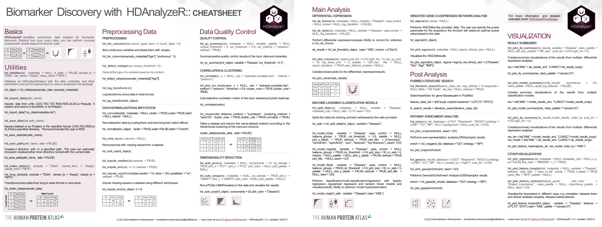

# HDAnalyzeR <a href="https://kantonopoulos.github.io/HDAnalyzeR"></a>

[](https://github.com/kantonopoulos/HDAnalyzeR/actions/workflows/R-CMD-check.yaml)
[](https://doi.org/10.5281/zenodo.13786124)
[](https://github.com/kantonopoulos/HDAnalyzeR) 
[](https://github.com/kantonopoulos/HDAnalyzeR/blob/main/LICENSE.md)

HDAnalyzeR is an R package developed by the Human Disease Blood Atlas to simplify proteomics data analysis for biomarker discovery in disease research. It provides a set of user-friendly functions to efficiently process blood plasma proteomics data and gain insights into disease mechanisms. With HDAnalyzeR, you can easily perform tasks like protein differential expression analysis, classification modeling, dimensionality reduction, imputation, and data visualization. 

The package is designed to be intuitive and accessible, even for those with limited programming experience, making it ideal for bioinformaticians, clinicians, and molecular biologists. It offers ready-to-use functions that reduce analysis time while ensuring high-quality results. Its powerful visualization tools also help present findings in clear, publication-ready plots, improving both the analysis and communication of results. Whether you're analyzing omics data for research or clinical applications, HDAnalyzeR simplifies the process, enhances reproducibility, and supports the discovery of potential biomarkers in disease research.

## Key Features
- **Differential Expression Analysis:** Perform protein differential expression analysis with built-in support for multiple methods.
- **Machine Learning Models:** Train and evaluate classification models with integrated variable importance visualization.
- **Pathway Enrichment Analysis:** Identify enriched pathways and visualize results in multiple formats.
- **Weighted Correlation Network Analysis:** Construct co-expression networks and identify modules of interest.
- **Dimensionality Reduction:** Easily apply PCA or other dimensionality reduction techniques to explore complex data.
- **Imputation and NA Handling:** Handle missing data with imputation techniques and filtering options.
- **Publication-Ready Visualizations:** Generate high-quality plots, including volcano plots, heatmaps, and feature importance plots.

## Installation

You can install the **latest** (recommended) or development version of HDAnalyzeR from GitHub:

``` r
# Install devtools if you haven't already
install.packages("devtools")

# Install HDAnalyzeR latest version
options(timeout = 1200)  # Set timeout to 20 minutes to avoid timeout errors
devtools::install_github("kantonopoulos/HDAnalyzeR@v1.1.0")

# Install HDAnalyzeR development version
options(timeout = 1200)
devtools::install_github("kantonopoulos/HDAnalyzeR")
```

## Cheat Sheet

<a href="https://github.com/kantonopoulos/HDAnalyzeR/blob/main/cheatsheet/hdanalyzer_cheat-sheet.pdf"></a>

## Usage

The following example showcases how to perform differential expression analysis and plot the results. It is one of the many features of HDAnalyzeR. A complete guide is available through [package's documentation](https://kantonopoulos.github.io/HDAnalyzeR/).

``` r
library(HDAnalyzeR)

# Prepare data
hd_object <- hd_initialize(example_data, example_metadata)

# Run differential expression analysis
de_results <- hd_de_limma(hd_object, case = "AML")

# Plot volcano plot
de_results <- hd_plot_volcano(de_results)

# DE results and volcano plot for AML
de_results$de_res
de_results$volcano_plot
```

## Citation

Antonopoulos, K., Bueno Alvez, M., Johansson, E., & Edfors Arfwidsson, F. (2024). HDAnalyzeR: HDA Internal Package for Streamed-line Proteomics Analysis (1.1.0). Zenodo. https://doi.org/10.5281/zenodo.13786124

## Issues and Support

If you encounter any bugs or you want to recommend new features and changes to existing ones, please open a new issue on our GitHub repository.

## Contact

For any questions or further information, please contact us at [k.antono@outlook.com](mailto:k.antono@outlook.com).
