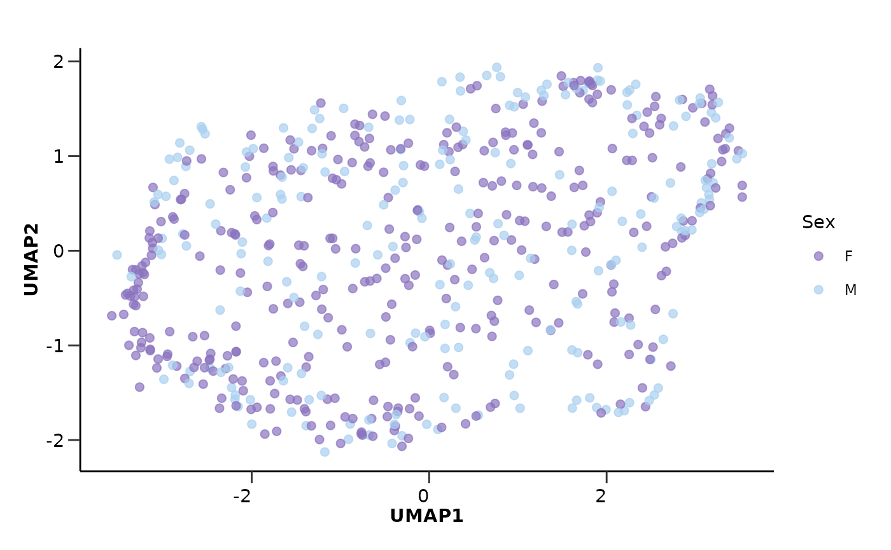
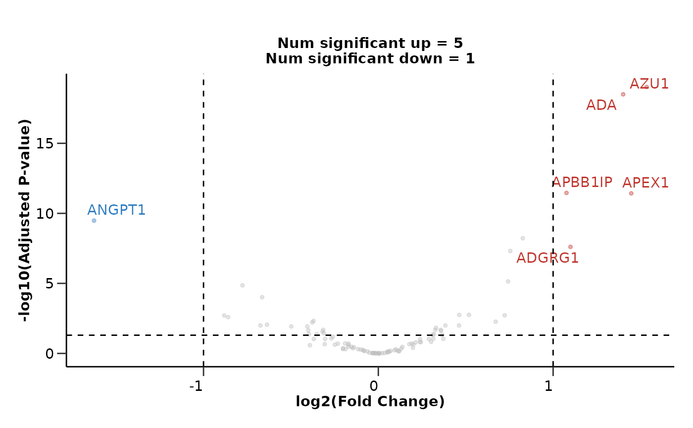
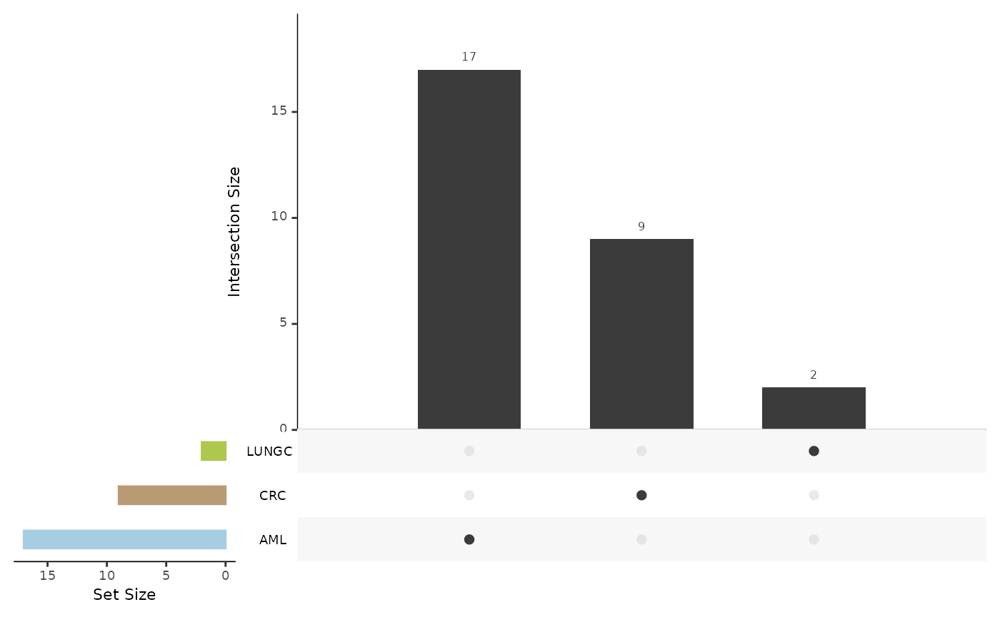
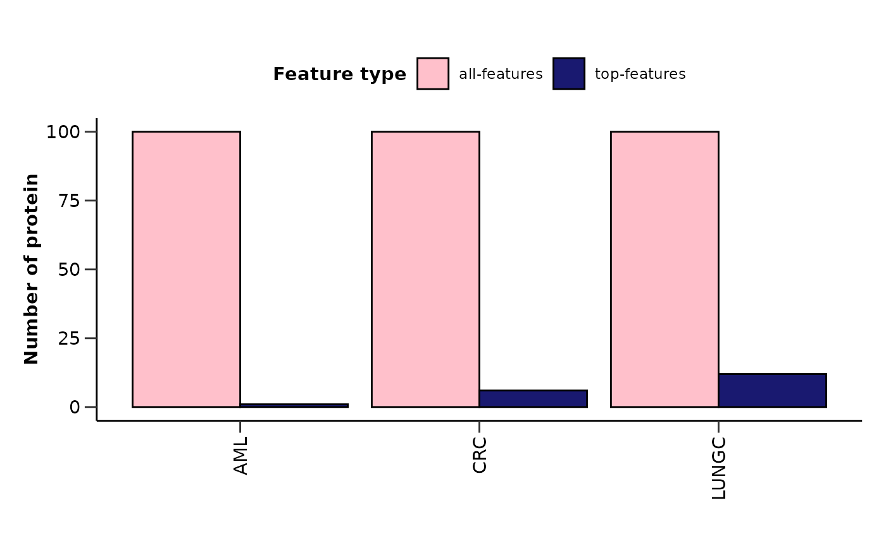
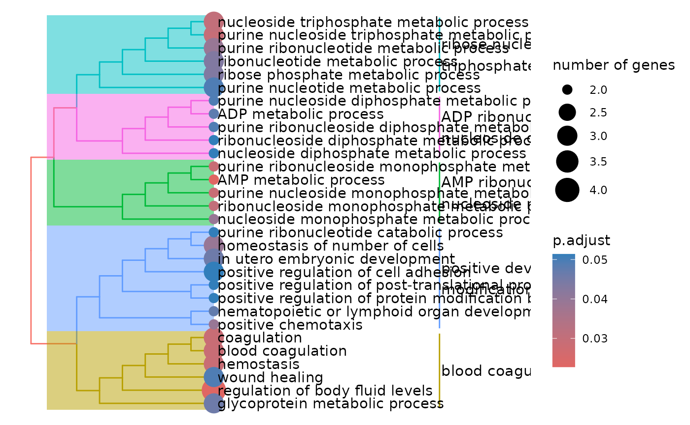

# HDAnalyzeR

## What is HDAnalyzeR?

HDAnalyzeR is an R package developed to streamline and enhance
proteomics analysis, particularly for biomarker discovery from blood
plasma samples. It is developed by the Human Disease Blood Atlas group.
This vignette will guide you through the essential steps to use the
package from data loading to biomarker identification. Let’s get started
by loading the package!

``` r
library(HDAnalyzeR)
```

## How to get Help?

If you need help with the package, you can use the `?` operator to
access the documentation for a specific function. For example, to access
the documentation for the
[`hd_initialize()`](https://kantonopoulos.github.io/HDAnalyzeR/reference/hd_initialize.md)
function, you can run:

``` r
?hd_initialize
```

All package functions can be found in the [HDAnalyzeR Function
Reference](https://hda1472.github.io/HDAnalyzeR/reference/index.html)
page. For whole example workflows you can visit any of the package
articles.

This document introduces you to HDAnalyzeR’s basic set of tools, and
shows you how to analyze and identify biomarkers in a artificial dataset
of cancer blood plasma samples.

## Loading the Data

First, we load the package’s `example_data` and `example_metadata`.

``` r
head(example_data)
#>      DAid    Sample  OlinkID UniProt  Assay           Panel        NPX
#> 1 DA00001 AML_syn_1 OID21311  Q9BTE6 AARSD1        Oncology  3.3903461
#> 2 DA00001 AML_syn_1 OID21280  P00519   ABL1        Oncology  2.7588517
#> 3 DA00001 AML_syn_1 OID21269  P09110  ACAA1        Oncology  1.7070090
#> 4 DA00001 AML_syn_1 OID20159  P16112   ACAN Cardiometabolic  0.0332709
#> 5 DA00001 AML_syn_1 OID20105  Q9BYF1   ACE2 Cardiometabolic  1.7553590
#> 6 DA00001 AML_syn_1 OID20124  Q15067  ACOX1 Cardiometabolic -0.9192835
#>   Assay_Warning QC_Warning PlateID
#> 1          PASS       PASS  Run001
#> 2          PASS       PASS  Run001
#> 3          PASS       PASS  Run001
#> 4          PASS       PASS  Run001
#> 5          PASS       PASS  Run001
#> 6          PASS       PASS  Run001
```

``` r
head(example_metadata)
#>      DAid    Sample Disease   Stage Grade Sex Age  BMI Cohort
#> 1 DA00001 AML_syn_1     AML       2  <NA>   F  42 22.7   UCAN
#> 2 DA00002 AML_syn_2     AML Unknown  <NA>   M  69 33.1   UCAN
#> 3 DA00003 AML_syn_3     AML       2  <NA>   F  61 26.2   UCAN
#> 4 DA00004 AML_syn_4     AML Unknown  <NA>   M  54 28.1   UCAN
#> 5 DA00005 AML_syn_5     AML       2  <NA>   F  57 21.4   UCAN
#> 6 DA00006 AML_syn_6     AML Unknown  <NA>   M  86 33.9   UCAN
```

We will initialize the HDAnalyzeR object with the data and metadata. The
[`hd_initialize()`](https://kantonopoulos.github.io/HDAnalyzeR/reference/hd_initialize.md)
function will create an object that will be used throughout the
analysis. We will specify the sample ID, variable name, and value name
in order to correctly load and widen the data. In this case, the data is
in long format, so we set `is_wide = FALSE`.

``` r
hd_obj <- hd_initialize(dat = example_data, 
                        metadata = example_metadata, 
                        is_wide = FALSE, 
                        sample_id = "DAid",
                        var_name = "Assay",
                        value_name = "NPX")
```

``` r
# See the data transformed into a wide format!
head(hd_obj$data)
#> # A tibble: 6 × 101
#>   DAid    AARSD1  ABL1  ACAA1    ACAN   ACE2  ACOX1   ACP5   ACP6  ACTA2   ACTN4
#>   <chr>    <dbl> <dbl>  <dbl>   <dbl>  <dbl>  <dbl>  <dbl>  <dbl>  <dbl>   <dbl>
#> 1 DA00001   3.39  2.76  1.71   0.0333  1.76  -0.919 1.54    2.15   2.81   0.742 
#> 2 DA00002   1.42  1.25 -0.816 -0.459   0.826 -0.902 0.647   1.30   0.798 -0.0659
#> 3 DA00003  NA    NA    NA      0.989  NA      0.330 1.37   NA     NA     NA     
#> 4 DA00004   3.41  3.38  1.69  NA       1.52  NA     0.841   0.582  1.70   0.108 
#> 5 DA00005   5.01  5.05  0.128  0.401  -0.933 -0.584 0.0265  1.16   2.73   0.350 
#> 6 DA00006   6.83  1.18 -1.74  -0.156   1.53  -0.721 0.620   0.527  0.772 NA     
#> # ℹ 90 more variables: ACY1 <dbl>, ADA <dbl>, ADA2 <dbl>, ADAM15 <dbl>,
#> #   ADAM23 <dbl>, ADAM8 <dbl>, ADAMTS13 <dbl>, ADAMTS15 <dbl>, ADAMTS16 <dbl>,
#> #   ADAMTS8 <dbl>, ADCYAP1R1 <dbl>, ADGRE2 <dbl>, ADGRE5 <dbl>, ADGRG1 <dbl>,
#> #   ADGRG2 <dbl>, ADH4 <dbl>, ADM <dbl>, AGER <dbl>, AGR2 <dbl>, AGR3 <dbl>,
#> #   AGRN <dbl>, AGRP <dbl>, AGXT <dbl>, AHCY <dbl>, AHSP <dbl>, AIF1 <dbl>,
#> #   AIFM1 <dbl>, AK1 <dbl>, AKR1B1 <dbl>, AKR1C4 <dbl>, AKT1S1 <dbl>,
#> #   AKT3 <dbl>, ALCAM <dbl>, ALDH1A1 <dbl>, ALDH3A1 <dbl>, ALPP <dbl>, …
```

> 📓 In real-world scenarios, you would load your own data and metadata
> files instead of using the example dataset.

> ⚠️ It is strongly recommended to use
> [`hd_initialize()`](https://kantonopoulos.github.io/HDAnalyzeR/reference/hd_initialize.md)
> function to initialize an HDAnalyzeR object before starting any
> analysis. This initialization step ensures that your input data and
> metadata are correctly formatted and compatible with the package.
> While it is possible to use HDAnalyzeR functions on data outside of an
> HDAnalyzeR object, users must ensure that the data adheres to the
> required structure: the first column must contain sample IDs, followed
> by numeric columns in wide format. Additionally, the metadata must
> include the same set of sample IDs. Proper initialization or careful
> adherence to these requirements is crucial for accurate and efficient
> analysis.

## Quality Control (QC)

[`hd_qc_summary()`](https://kantonopoulos.github.io/HDAnalyzeR/reference/hd_qc_summary.md)
provides a comprehensive summary of the input data and metadata.

Regarding the data, it will check the column types, calculate the
percentage of NAs in each column and row and plot their distributions,
calculate variable-variable (in this case protein-protein) correlations,
and create a heatmap of these correlations. Users can also specify the
threshold for reporting variable-variable correlations.

Regarding the metadata, it will check the column types and calculate the
percentage of NAs in each column and row exactly as before. It will also
create summary visualizations for the metadata variables like “Sex” and
“Age”.

Let’s run the QC summary and take a look at some results!

``` r
qc_data <- hd_qc_summary(hd_obj, 
                         variable = "Disease", 
                         palette = list(Disease = "cancers12", Sex = "sex"), 
                         cor_threshold = 0.7,
                         verbose = FALSE)

qc_data$data_summary$na_col_hist
#> `stat_bin()` using `bins = 30`. Pick better value `binwidth`.
```


``` r
qc_data$data_summary$cor_heatmap
```


``` r
qc_data$metadata_summary$Sex
```


``` r
qc_data$metadata_summary$Age
#> Picking joint bandwidth of 6.06
```


## Imputation and Dimensionality Reduction

As we saw from the QC results, the data contains NAs and other issues
that need to be addressed. We will impute missing values using K-nearest
neighbors (KNN) with 5 neighbors via
[`hd_impute_knn()`](https://kantonopoulos.github.io/HDAnalyzeR/reference/hd_impute_knn.md).

``` r
hd_obj <- hd_impute_knn(hd_obj, k = 5, verbose = FALSE)
head(hd_obj$data)
#> # A tibble: 6 × 101
#>   DAid    AARSD1  ABL1  ACAA1    ACAN   ACE2  ACOX1   ACP5  ACP6 ACTA2   ACTN4
#>   <chr>    <dbl> <dbl>  <dbl>   <dbl>  <dbl>  <dbl>  <dbl> <dbl> <dbl>   <dbl>
#> 1 DA00001   3.39  2.76  1.71   0.0333  1.76  -0.919 1.54   2.15  2.81   0.742 
#> 2 DA00002   1.42  1.25 -0.816 -0.459   0.826 -0.902 0.647  1.30  0.798 -0.0659
#> 3 DA00003   3.70  2.85  2.27   0.989   0.184  0.330 1.37   0.876 1.33   0.570 
#> 4 DA00004   3.41  3.38  1.69   0.415   1.52   1.23  0.841  0.582 1.70   0.108 
#> 5 DA00005   5.01  5.05  0.128  0.401  -0.933 -0.584 0.0265 1.16  2.73   0.350 
#> 6 DA00006   6.83  1.18 -1.74  -0.156   1.53  -0.721 0.620  0.527 0.772  0.446 
#> # ℹ 90 more variables: ACY1 <dbl>, ADA <dbl>, ADA2 <dbl>, ADAM15 <dbl>,
#> #   ADAM23 <dbl>, ADAM8 <dbl>, ADAMTS13 <dbl>, ADAMTS15 <dbl>, ADAMTS16 <dbl>,
#> #   ADAMTS8 <dbl>, ADCYAP1R1 <dbl>, ADGRE2 <dbl>, ADGRE5 <dbl>, ADGRG1 <dbl>,
#> #   ADGRG2 <dbl>, ADH4 <dbl>, ADM <dbl>, AGER <dbl>, AGR2 <dbl>, AGR3 <dbl>,
#> #   AGRN <dbl>, AGRP <dbl>, AGXT <dbl>, AHCY <dbl>, AHSP <dbl>, AIF1 <dbl>,
#> #   AIFM1 <dbl>, AK1 <dbl>, AKR1B1 <dbl>, AKR1C4 <dbl>, AKT1S1 <dbl>,
#> #   AKT3 <dbl>, ALCAM <dbl>, ALDH1A1 <dbl>, ALDH3A1 <dbl>, ALPP <dbl>, …
```

After imputation, we will run Principal Component Analysis (PCA) via
[`hd_auto_pca()`](https://kantonopoulos.github.io/HDAnalyzeR/reference/hd_auto_pca.md)
and Uniform Manifold Approximation and Projection (UMAP) via
[`hd_auto_umap()`](https://kantonopoulos.github.io/HDAnalyzeR/reference/hd_auto_umap.md)
to check for outliers, batch effects, and other potential issues. These
are wrapper functions that will run the necessary steps to perform PCA
and UMAP, including scaling the data and coloring the plots by metadata
variables.

``` r
pca_res <- hd_auto_pca(hd_obj, 
                       components = 10, 
                       plot_color = "Disease", 
                       plot_palette = "cancers12")

head(pca_res$pca_res)
#> # A tibble: 6 × 11
#>   DAid     PC1     PC2    PC3    PC4    PC5    PC6    PC7    PC8     PC9    PC10
#>   <chr>  <dbl>   <dbl>  <dbl>  <dbl>  <dbl>  <dbl>  <dbl>  <dbl>   <dbl>   <dbl>
#> 1 DA00… -3.69  -4.32   -2.30  -3.15  -2.53  -2.78  -2.77   0.603 -3.20   -0.532 
#> 2 DA00…  4.17  -2.70    2.10  -0.472 -4.47  -1.96  -1.04   1.51  -0.229  -0.0614
#> 3 DA00… -3.31   4.74    1.41   0.920 -0.588  0.316 -0.103 -0.441  1.36    0.201 
#> 4 DA00… -4.78   0.447   1.44   0.134 -1.15  -0.284  0.279  3.34   0.0452 -0.866 
#> 5 DA00… -5.04  -3.69    0.820 -5.73  -0.697 -3.87  -1.01   1.96  -0.970  -1.12  
#> 6 DA00…  0.429  0.0714 -1.86  -7.80   0.809 -2.89  -0.733  0.381 -0.617   1.32
pca_res$pca_plot
#> Ignoring unknown labels:
#> • Color : "Disease"
```


``` r
pca_res$pca_loadings_plot
```


``` r
pca_res$pca_variance_plot
```


Let’s color UMAP by Sex instead of Disease to see if there are any sex
related differences.

``` r
umap_res <- hd_auto_umap(hd_obj, 
                         plot_color = "Sex", 
                         plot_palette = "sex")

head(umap_res$umap_res)
#> # A tibble: 6 × 3
#>   DAid    UMAP1  UMAP2
#>   <chr>   <dbl>  <dbl>
#> 1 DA00001  2.25 -0.712
#> 2 DA00002 -2.23 -1.45 
#> 3 DA00003  1.90  1.65 
#> 4 DA00004  2.30  1.24 
#> 5 DA00005  2.55 -0.620
#> 6 DA00006 -1.32  1.29
umap_res$umap_plot
#> Ignoring unknown labels:
#> • Color : "Sex"
```



## Biomarker Identification

### Differential Expression Analysis

We will run a differential expression analysis to identify potential
biomarkers. We will use
[`hd_de_limma()`](https://kantonopoulos.github.io/HDAnalyzeR/reference/hd_de_limma.md)
so that we will be able to correct also for Sex and Age. This method
will help us pinpoint proteins that are significantly different between
conditions. We will run the analysis 3 times for different case classes
against all other classes each time. We will also run
[`hd_plot_volcano()`](https://kantonopoulos.github.io/HDAnalyzeR/reference/hd_plot_volcano.md)
to visualize the results. We will present only the results for Acute
Myeloid Leukemia (AML).

``` r
de_res_aml <- hd_de_limma(hd_obj,
                          variable = "Disease",
                          case = "AML",
                          correct = c("Sex", "Age")) |> 
  hd_plot_volcano(logfc_lim = 1)

head(de_res_aml$de_res)
#> # A tibble: 6 × 10
#>   Feature  logFC   CI.L  CI.R AveExpr     t  P.Value adj.P.Val     B Disease
#>   <chr>    <dbl>  <dbl> <dbl>   <dbl> <dbl>    <dbl>     <dbl> <dbl> <chr>  
#> 1 AZU1     1.54   1.23   1.84   0.226  9.97 9.51e-22  9.51e-20  38.5 AML    
#> 2 ADA      1.40   1.12   1.68   0.924  9.75 6.37e-21  3.19e-19  36.6 AML    
#> 3 APBB1IP  1.08   0.799  1.35  -0.253  7.62 1.04e-13  3.45e-12  20.3 AML    
#> 4 APEX1    1.45   1.07   1.82   0.515  7.56 1.50e-13  3.74e-12  19.9 AML    
#> 5 ANGPT1  -1.63  -2.09  -1.16   1.72  -6.87 1.65e-11  3.29e-10  15.3 AML    
#> 6 ARTN     0.826  0.572  1.08   0.423  6.38 3.60e-10  6.00e- 9  12.3 AML
de_res_aml$volcano_plot
```



``` r
de_res_crc <- hd_de_limma(hd_obj,
                          variable = "Disease",
                          case = "CRC",
                          correct = c("Sex", "Age"))
```

``` r
de_res_lungc <- hd_de_limma(hd_obj,
                            variable = "Disease",
                            case = "LUNGC",
                            correct = c("Sex", "Age"))
```

We can also summarize the results via
[`hd_plot_de_summary()`](https://kantonopoulos.github.io/HDAnalyzeR/reference/hd_plot_de_summary.md).
In order to use this function we need to store all the results in a
list.

``` r
de_res <- list("AML" = de_res_aml, 
               "CRC" = de_res_crc, 
               "LUNGC" = de_res_lungc)

de_summary <- hd_plot_de_summary(de_res, class_palette = "cancers12")
```

``` r
de_summary$de_barplot
```


``` r
de_summary$upset_plot_up
```


``` r
de_summary$upset_plot_down
```



### Machine Learning Classification Model

In addition to differential expression analysis, we will use a
regularized machine learning classification model (LASSO) to identify
significant features. This model will help us understand which protein
features are most predictive of the conditions being studied.

We will start by creating the data split with
[`hd_split_data()`](https://kantonopoulos.github.io/HDAnalyzeR/reference/hd_split_data.md)
so we don’t have any data leakage between train and test data and then
we will run the model with
[`hd_model_rreg()`](https://kantonopoulos.github.io/HDAnalyzeR/reference/hd_model_rreg.md).
Once again, we will run the analysis 3 times but we will present only
the results for AML.

``` r
hd_split <- hd_split_data(hd_obj, variable = "Disease")

lasso_res_aml <- hd_model_rreg(hd_split, 
                               variable = "Disease",
                               case = "AML",
                               mixture = 1,
                               grid_size = 5,
                               palette = "cancers12",
                               verbose = FALSE)

lasso_res_aml$metrics
#> $accuracy
#> [1] 0.7959184
#> 
#> $sensitivity
#> [1] 0.9166667
#> 
#> $specificity
#> [1] 0.7851852
#> 
#> $auc
#> [1] 0.9351852
#> 
#> $confusion_matrix
#>           Truth
#> Prediction   0   1
#>          0 106   1
#>          1  29  11
lasso_res_aml$roc_curve
```


``` r
lasso_res_aml$probability_plot
```


``` r
lasso_res_aml$feat_imp_plot
```


``` r
lasso_res_crc <- hd_model_rreg(hd_split, 
                               variable = "Disease",
                               case = "CRC",
                               mixture = 1,
                               grid_size = 5,
                               palette = "cancers12",
                               verbose = FALSE)
```

``` r
lasso_res_lungc <- hd_model_rreg(hd_split, 
                                 variable = "Disease",
                                 case = "LUNGC",
                                 mixture = 1,
                                 grid_size = 5,
                                 palette = "cancers12",
                                 verbose = FALSE)
```

We can get a visual summary of the results via
[`hd_plot_model_summary()`](https://kantonopoulos.github.io/HDAnalyzeR/reference/hd_plot_model_summary.md).
In order to use this function we need to store the results in a list as
before.

``` r
lasso_res <- list("AML" = lasso_res_aml, 
                  "CRC" = lasso_res_crc, 
                  "LUNGC" = lasso_res_lungc)

features_summary <- hd_plot_model_summary(lasso_res, class_palette = "cancers12")
```

``` r
features_summary$metrics_barplot
#> Ignoring unknown labels:
#> • colour : "Metric"
```


``` r
features_summary$features_barplot
```



``` r
features_summary$upset_plot_features
```


## One step further

The final step involves performing a pathway enrichment analysis to get
more biological information about the features. In this example, we will
run an Over-Representation Analysis for the up-regulated proteins from
differential expression, that are also identified as features by the ML
model. We will use the Gene Ontology (GO) database and show the results
only for AML. We will use
[`hd_ora()`](https://kantonopoulos.github.io/HDAnalyzeR/reference/hd_ora.md)
and
[`hd_plot_ora()`](https://kantonopoulos.github.io/HDAnalyzeR/reference/hd_plot_ora.md)
to perform the analysis and visualize its results.

``` r
# Extract the proteins identified by both DE and Lasso
de_proteins <- de_res_aml$de_res |> 
  dplyr::filter(adj.P.Val < 0.05) |> 
  dplyr::pull(Feature)

lasso_proteins <- lasso_res_aml$features |> 
  dplyr::filter(Scaled_Importance > 0) |> 
  dplyr::pull(Feature)

intersect_proteins <- intersect(de_proteins, lasso_proteins)

# Perform ORA with GO database and visualize results
enrichment <- hd_ora(intersect_proteins, 
                     database = "GO", 
                     ontology = "BP", 
                     pval_lim = 0.2)  # We will use a higher p-value threshold for this example
enrichment_plots <- hd_plot_ora(enrichment)

enrichment_plots$dotplot
```


``` r
enrichment_plots$treeplot
#> NULL
enrichment_plots$cnetplot
```



> 📓 Remember that these data are a dummy-dataset with artificial data
> and the results in this guide should not be interpreted as real
> results. The purpose of this vignette is to show you how to use the
> package and its functions.

``` r
sessionInfo()
#> R version 4.5.2 (2025-10-31)
#> Platform: x86_64-pc-linux-gnu
#> Running under: Ubuntu 24.04.3 LTS
#> 
#> Matrix products: default
#> BLAS:   /usr/lib/x86_64-linux-gnu/openblas-pthread/libblas.so.3 
#> LAPACK: /usr/lib/x86_64-linux-gnu/openblas-pthread/libopenblasp-r0.3.26.so;  LAPACK version 3.12.0
#> 
#> locale:
#>  [1] LC_CTYPE=C.UTF-8       LC_NUMERIC=C           LC_TIME=C.UTF-8       
#>  [4] LC_COLLATE=C.UTF-8     LC_MONETARY=C.UTF-8    LC_MESSAGES=C.UTF-8   
#>  [7] LC_PAPER=C.UTF-8       LC_NAME=C              LC_ADDRESS=C          
#> [10] LC_TELEPHONE=C         LC_MEASUREMENT=C.UTF-8 LC_IDENTIFICATION=C   
#> 
#> time zone: UTC
#> tzcode source: system (glibc)
#> 
#> attached base packages:
#> [1] stats     graphics  grDevices utils     datasets  methods   base     
#> 
#> other attached packages:
#> [1] HDAnalyzeR_0.99.0
#> 
#> loaded via a namespace (and not attached):
#>   [1] RcppAnnoy_0.0.22        splines_4.5.2           ggplotify_0.1.3        
#>   [4] tibble_3.3.0            R.oo_1.27.1             hardhat_1.4.2          
#>   [7] rpart_4.1.24            sparsevctrs_0.3.4       lifecycle_1.0.4        
#>  [10] globals_0.18.0          lattice_0.22-7          MASS_7.3-65            
#>  [13] backports_1.5.0         SnowballC_0.7.1         magrittr_2.0.4         
#>  [16] limma_3.66.0            sass_0.4.10             rmarkdown_2.30         
#>  [19] jquerylib_0.1.4         yaml_2.3.10             ggtangle_0.0.8         
#>  [22] askpass_1.2.1           reticulate_1.44.0       cowplot_1.2.0          
#>  [25] DBI_1.2.3               RColorBrewer_1.1-3      lubridate_1.9.4        
#>  [28] purrr_1.2.0             R.utils_2.13.0          BiocGenerics_0.56.0    
#>  [31] yulab.utils_0.2.1       nnet_7.3-20             rappdirs_0.3.3         
#>  [34] ipred_0.9-15            gdtools_0.4.4           lava_1.8.2             
#>  [37] IRanges_2.44.0          embed_1.2.0             S4Vectors_0.48.0       
#>  [40] enrichplot_1.30.1       ggrepel_0.9.6           tokenizers_0.3.0       
#>  [43] listenv_0.10.0          tidytree_0.4.6          pheatmap_1.0.13        
#>  [46] umap_0.2.10.0           RSpectra_0.16-2         parallelly_1.45.1      
#>  [49] pkgdown_2.2.0           codetools_0.2-20        DOSE_4.4.0             
#>  [52] tidyselect_1.2.1        shape_1.4.6.1           aplot_0.2.9            
#>  [55] farver_2.1.2            stats4_4.5.2            Seqinfo_1.0.0          
#>  [58] jsonlite_2.0.0          ggridges_0.5.7          survival_3.8-3         
#>  [61] iterators_1.0.14        systemfonts_1.3.1       foreach_1.5.2          
#>  [64] ggnewscale_0.5.2        tools_4.5.2             treeio_1.34.0          
#>  [67] ragg_1.5.0              Rcpp_1.1.0              glue_1.8.0             
#>  [70] prodlim_2025.04.28      gridExtra_2.3           xfun_0.54              
#>  [73] qvalue_2.42.0           tidyheatmaps_0.2.1      dplyr_1.1.4            
#>  [76] withr_3.0.2             fastmap_1.2.0           openssl_2.3.4          
#>  [79] digest_0.6.37           timechange_0.3.0        R6_2.6.1               
#>  [82] gridGraphics_0.5-1      textshaping_1.0.4       GO.db_3.22.0           
#>  [85] RSQLite_2.4.4           R.methodsS3_1.8.2       UpSetR_1.4.0           
#>  [88] utf8_1.2.6              tidyr_1.3.1             generics_0.1.4         
#>  [91] fontLiberation_0.1.0    data.table_1.17.8       recipes_1.3.1          
#>  [94] class_7.3-23            httr_1.4.7              htmlwidgets_1.6.4      
#>  [97] uwot_0.2.4              pkgconfig_2.0.3         gtable_0.3.6           
#> [100] parsnip_1.3.3           timeDate_4051.111       dials_1.4.2            
#> [103] blob_1.2.4              GPfit_1.0-9             S7_0.2.0               
#> [106] workflows_1.3.0         XVector_0.50.0          furrr_0.3.1            
#> [109] clusterProfiler_4.18.1  janeaustenr_1.0.0       htmltools_0.5.8.1      
#> [112] fontBitstreamVera_0.1.1 fgsea_1.36.0            scales_1.4.0           
#> [115] Biobase_2.70.0          png_0.1-8               gower_1.0.2            
#> [118] ggfun_0.2.0             knitr_1.50              reshape2_1.4.4         
#> [121] nlme_3.1-168            org.Hs.eg.db_3.22.0     cachem_1.1.0           
#> [124] stringr_1.6.0           rsample_1.3.1           parallel_4.5.2         
#> [127] AnnotationDbi_1.72.0    desc_1.4.3              pillar_1.11.1          
#> [130] grid_4.5.2              vctrs_0.6.5             tune_2.0.1             
#> [133] vip_0.4.1               lhs_1.2.0               yardstick_1.3.2        
#> [136] evaluate_1.0.5          cli_3.6.5               compiler_4.5.2         
#> [139] rlang_1.1.6             crayon_1.5.3            tidytext_0.4.3         
#> [142] future.apply_1.20.0     labeling_0.4.3          plyr_1.8.9             
#> [145] forcats_1.0.1           fs_1.6.6                ggiraph_0.9.2          
#> [148] stringi_1.8.7           BiocParallel_1.44.0     Biostrings_2.78.0      
#> [151] lazyeval_0.2.2          fontquiver_0.2.1        glmnet_4.1-10          
#> [154] GOSemSim_2.36.0         Matrix_1.7-4            patchwork_1.3.2        
#> [157] bit64_4.6.0-1           future_1.67.0           ggplot2_4.0.0          
#> [160] KEGGREST_1.50.0         statmod_1.5.1           tailor_0.1.0           
#> [163] igraph_2.2.1            broom_1.0.10            memoise_2.0.1          
#> [166] bslib_0.9.0             ggtree_4.0.1            fastmatch_1.1-6        
#> [169] bit_4.6.0               gson_0.1.0              ape_5.8-1              
#> [172] DiceDesign_1.10
```
