# Machine Learning Models

This vignette will show you how you can easily construct machine
learning pipelines using HDAnalyzeR. We will load HDAnalyzeR and dplyr,
load the example data and metadata that come with the package and
initialize the HDAnalyzeR object.

## Loading the Data

``` r

library(HDAnalyzeR)
library(dplyr)

hd_obj <- hd_initialize(dat = example_data, 
                        metadata = example_metadata, 
                        is_wide = FALSE, 
                        sample_id = "DAid",
                        var_name = "Assay",
                        value_name = "NPX")
```

> 📓 In the whole vignette the `verbose` parameter of the model
> functions will be set to FALSE in order to keep this guide clean and
> concise. However, we recommend to leave it to default (TRUE) in order
> to know the model’s progress and that everything is running smoothly.

## Splitting the Data

First, we will create the data split object using the
[`hd_split_data()`](https://kantonopoulos.github.io/HDAnalyzeR/reference/hd_split_data.md)
function. This function will create a list of the train and test sets.
We can change the ratio of the train and test sets, the seed for
reproducibility, and the metadata variable to classify. At this stage,
we can also add metadata columns as predictors.

We will use the `Disease` column as the variable to classify and the
`Sex` and `Age` columns as a metadata predictor.

``` r

split_obj <- hd_split_data(hd_obj, 
                           variable = "Disease", 
                           ratio = 0.8, 
                           seed = 123, 
                           metadata_cols = c("Sex", "Age"))
```

## Running the Model

### Regularized Regression

Let’s start with a regularized regression LASSO model via
[`hd_model_rreg()`](https://kantonopoulos.github.io/HDAnalyzeR/reference/hd_model_rreg.md).
Exactly like in the previous vignette with the differential expression
functions, we have to state the variable, case and control(s) groups. To
do specifically LASSO we will set the `mixture` parameter to 1. We will
also set the `verbose` parameter to `FALSE` to not print the progress of
the model in shake of clarity for this vignette.

``` r

model_res <- hd_model_rreg(split_obj,
                           variable = "Disease",
                           case = "AML",
                           control = c("CLL", "MYEL", "GLIOM"),
                           grid_size = 5,
                           mixture = 1,
                           verbose = FALSE)

model_res$final_workflow
#> ══ Workflow ════════════════════════════════════════════════════════════════════
#> Preprocessor: Recipe
#> Model: logistic_reg()
#> 
#> ── Preprocessor ────────────────────────────────────────────────────────────────
#> 5 Recipe Steps
#> 
#> • step_dummy()
#> • step_nzv()
#> • step_normalize()
#> • step_corr()
#> • step_impute_knn()
#> 
#> ── Model ───────────────────────────────────────────────────────────────────────
#> Logistic Regression Model Specification (classification)
#> 
#> Main Arguments:
#>   penalty = 0.0882888198144988
#>   mixture = mixture
#> 
#> Computational engine: glmnet
model_res$metrics
#> $accuracy
#> [1] 0.8529412
#> 
#> $sensitivity
#> [1] 1
#> 
#> $specificity
#> [1] 0.7916667
#> 
#> $auc
#> [1] 0.95
#> 
#> $confusion_matrix
#>           Truth
#> Prediction  0  1
#>          0 19  0
#>          1  5 10
model_res$roc_curve
```

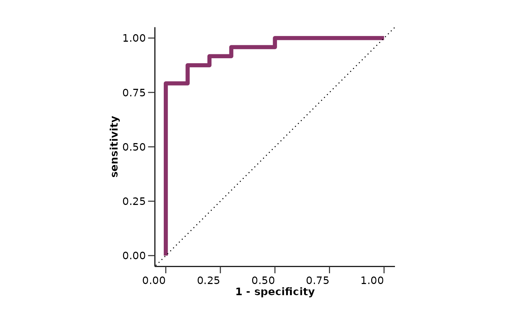

``` r

model_res$probability_plot
```

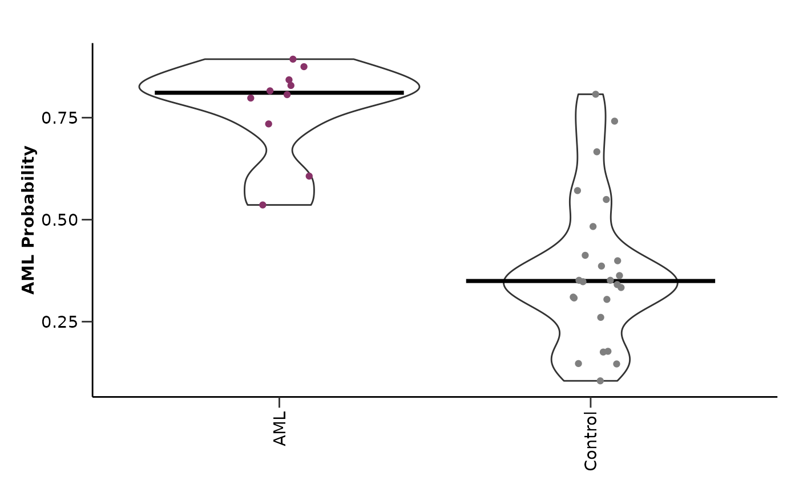

``` r

model_res$feat_imp_plot
```

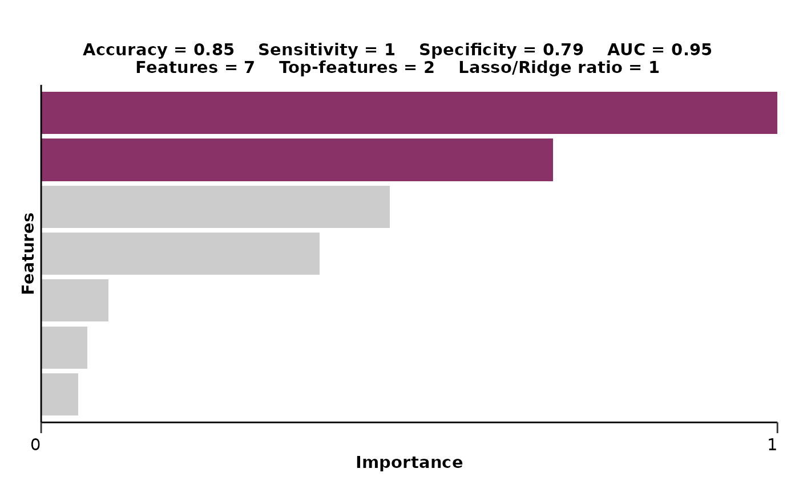

We can change several parameters in the
[`hd_model_rreg()`](https://kantonopoulos.github.io/HDAnalyzeR/reference/hd_model_rreg.md)
function. For example, we can change the number of cross-validation
folds, the number of grid points for the hyperparameter optimization, or
the feature correlation threshold. Also, exactly as with the DE
functions, if the `control` parameter is not set, the function will use
all the other classes as controls. For more information, please refer to
[`hd_model_rreg()`](https://kantonopoulos.github.io/HDAnalyzeR/reference/hd_model_rreg.md)
documentation.

We will also set mixture to NULL to allow the model to optimize this
parameter as well (elastic net regression instead of LASSO) and set a
palette for our classes.

``` r

model_res <- hd_model_rreg(split_obj,
                           case = "AML",
                           cv_sets = 3,
                           grid_size = 5,
                           cor_threshold = 0.7,
                           palette = "cancers12",
                           verbose = FALSE)

model_res$final_workflow
#> ══ Workflow ════════════════════════════════════════════════════════════════════
#> Preprocessor: Recipe
#> Model: logistic_reg()
#> 
#> ── Preprocessor ────────────────────────────────────────────────────────────────
#> 5 Recipe Steps
#> 
#> • step_dummy()
#> • step_nzv()
#> • step_normalize()
#> • step_corr()
#> • step_impute_knn()
#> 
#> ── Model ───────────────────────────────────────────────────────────────────────
#> Logistic Regression Model Specification (classification)
#> 
#> Main Arguments:
#>   penalty = 6.46115834805338e-10
#>   mixture = 0.176478507297579
#> 
#> Computational engine: glmnet
```

### Random Forest

We can use a different variable to classify like `Sex` and even a
different algorithm like random forest via
[`hd_model_rf()`](https://kantonopoulos.github.io/HDAnalyzeR/reference/hd_model_rf.md).
However, do not forget that we should create a new split object for this
new model. In this case, because the classes are already balanced, we
will set the `balance_groups` parameter to FALSE to consider all the
samples in the training dataset. Let’s also remove everything except
from number of features and AUC from the variable importance plot title.

``` r

split_obj <- hd_split_data(hd_obj, variable = "Sex", ratio = 0.8)
                               
model_res <- hd_model_rf(split_obj,
                       variable = "Sex",
                       case = "F",
                       palette = "sex",
                       cv_sets = 3,
                       grid_size = 5,
                       balance_groups = FALSE,
                       plot_title = c("features", "auc"),
                       verbose = FALSE)
```

### Logistic Regression

If our data have a single predictor, we can use
[`hd_model_lr()`](https://kantonopoulos.github.io/HDAnalyzeR/reference/hd_model_lr.md)
instead of
[`hd_model_rreg()`](https://kantonopoulos.github.io/HDAnalyzeR/reference/hd_model_rreg.md)
to perform a logistic regression. Random forest can be used as it was
for multiple predictors.

``` r

hd_obj_single <- hd_initialize(dat = example_data |> filter(Assay == "ADA"), 
                               metadata = example_metadata, 
                               is_wide = FALSE, 
                               sample_id = "DAid",
                               var_name = "Assay",
                               value_name = "NPX")

split_obj <- hd_split_data(hd_obj_single, variable = "Disease", ratio = 0.8)

model_res <- hd_model_lr(split_obj, case = "AML", palette = "cancers12", verbose = FALSE)
```

## Visualizing Model Features

At this point we should also check how our selected protein features
look in boxplots. We will run a model as before, extract the features,
select the top-9 of them based on their importance in the model and plot
them with
[`hd_plot_feature_boxplot()`](https://kantonopoulos.github.io/HDAnalyzeR/reference/hd_plot_feature_boxplot.md).
We can either plot case vs control or case vs all other classes by
changing the `type` argument.

> ⚠️ In case you have metadata variables as features, you will have to
> remove them from the feature vector before using the
> [`hd_plot_feature_boxplot()`](https://kantonopoulos.github.io/HDAnalyzeR/reference/hd_plot_feature_boxplot.md)
> function as it is made to visualize protein features.

``` r

hd_obj <- hd_initialize(dat = example_data, 
                        metadata = example_metadata, 
                        is_wide = FALSE, 
                        sample_id = "DAid",
                        var_name = "Assay",
                        value_name = "NPX")

split_obj <- hd_split_data(hd_obj, variable = "Disease", ratio = 0.8)

model_res <- hd_model_rreg(split_obj, case = "AML", cv_sets = 3, grid_size = 5, verbose = FALSE)

features <- model_res$features |> arrange(desc(Scaled_Importance)) |> head(9) |> pull(Feature)

hd_plot_feature_boxplot(hd_obj, 
                        features = features, 
                        case = "AML", 
                        palette = "cancers12", 
                        type = "case_vs_control",
                        points = FALSE)
```

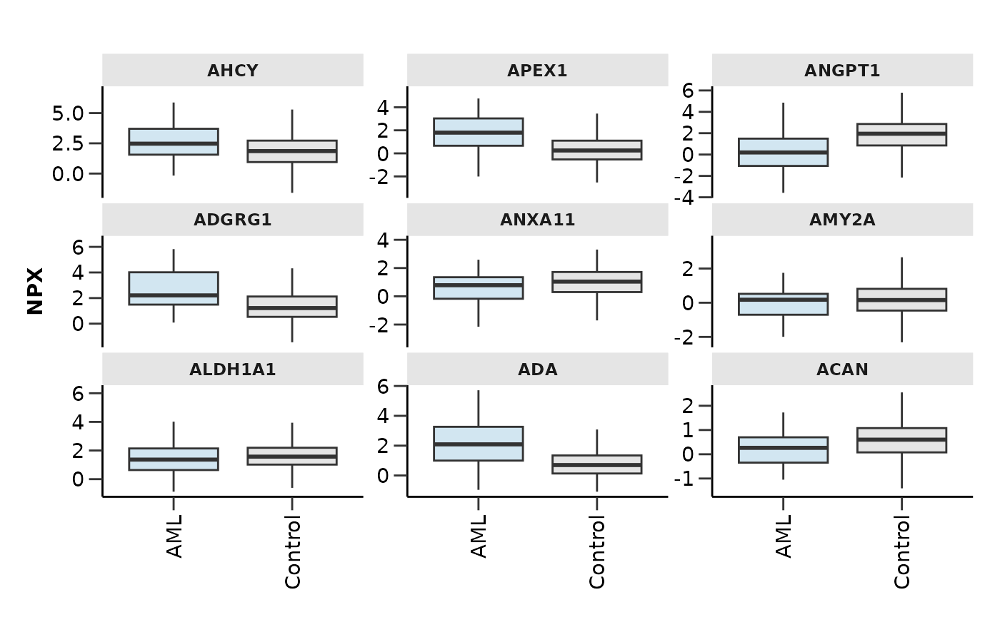

``` r


hd_plot_feature_boxplot(hd_obj, 
                        features = features, 
                        case = "AML", 
                        palette = "cancers12", 
                        type = "case_vs_all")
```

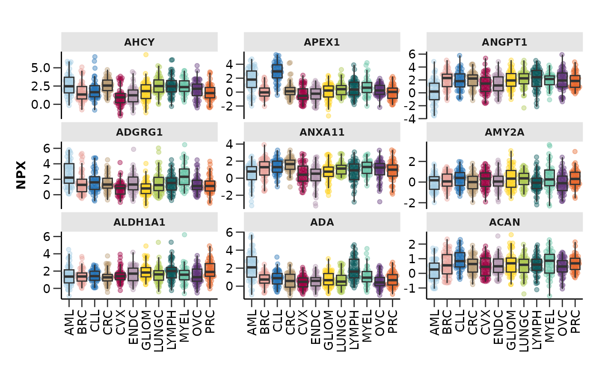

## Multi-classification Model

We can also do multiclassification predictions with all available
classes in the data. The only thing that we should change is set the
`case` argument to NULL so that the model understands that we want to
classify all the classes. Let’s see an example with regularized
regression!

``` r

model_res <- hd_model_rreg(split_obj, 
                           case = NULL, 
                           cv_sets = 3, 
                           grid_size = 5, 
                           palette = "cancers12",
                           verbose = FALSE)

model_res$final_workflow
#> ══ Workflow ════════════════════════════════════════════════════════════════════
#> Preprocessor: Recipe
#> Model: multinom_reg()
#> 
#> ── Preprocessor ────────────────────────────────────────────────────────────────
#> 5 Recipe Steps
#> 
#> • step_dummy()
#> • step_nzv()
#> • step_normalize()
#> • step_corr()
#> • step_impute_knn()
#> 
#> ── Model ───────────────────────────────────────────────────────────────────────
#> Multinomial Regression Model Specification (classification)
#> 
#> Main Arguments:
#>   penalty = 0.0367670028149144
#>   mixture = 0.601291495601181
#> 
#> Computational engine: glmnet
model_res$roc_curve
```

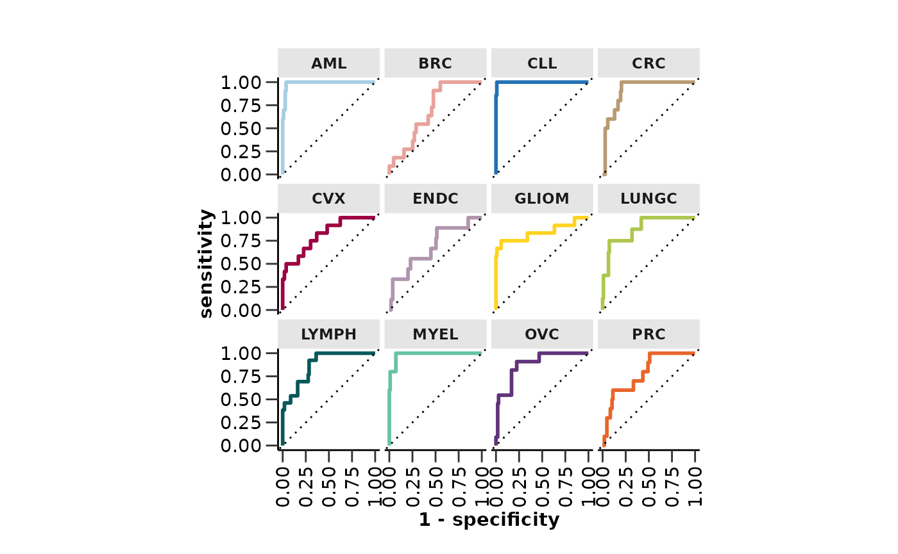

``` r

model_res$probability_plot
```

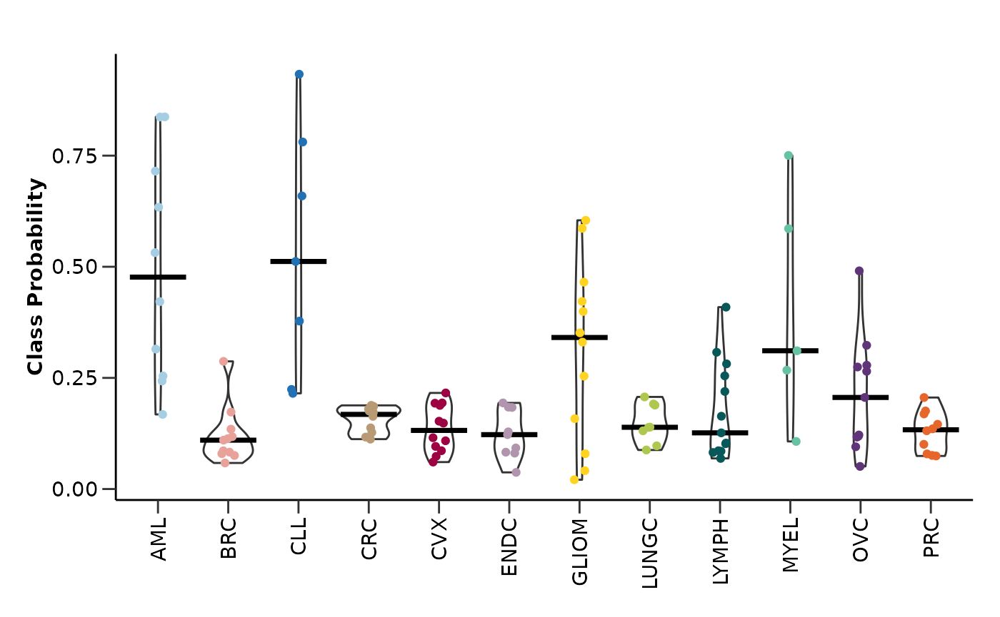

``` r

model_res$feat_imp_plot
```

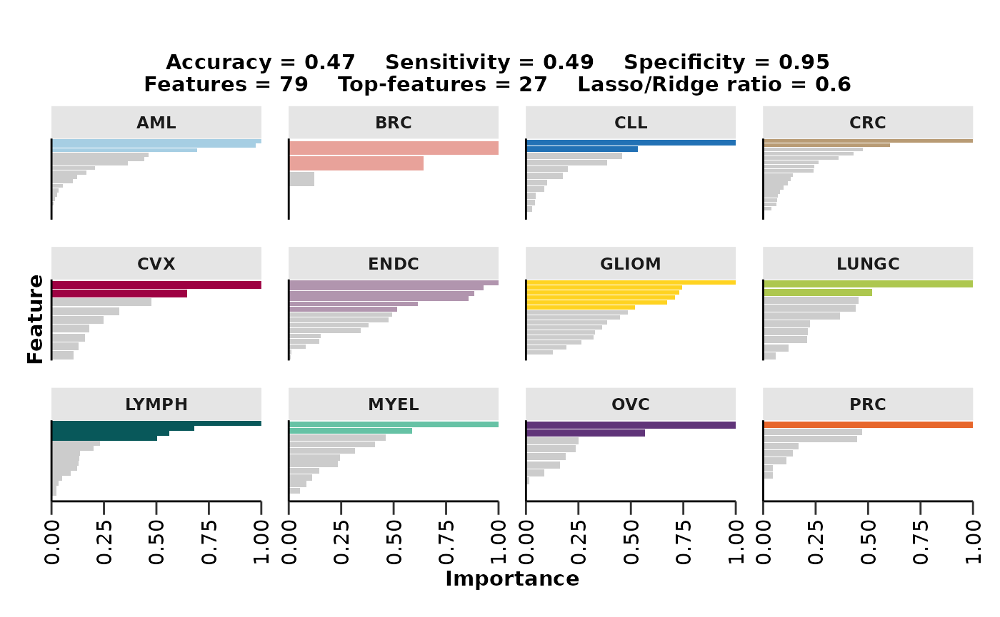

## Regression instead of Classification

Instead of a classification we can run a regression model. That means
that we will try to predict a continuous variable instead of a
categorical one. We can use either
[`hd_model_rreg()`](https://kantonopoulos.github.io/HDAnalyzeR/reference/hd_model_rreg.md)
or
[`hd_model_rf()`](https://kantonopoulos.github.io/HDAnalyzeR/reference/hd_model_rf.md)
functions with the `case` parameter set to NULL. Let’s see an example
with the `Age` variable. Do not forget that we have to create a new
split object for this new model with `Age` as the variable of interest.

> ⚠️ We should not forget to update the `plot_title` argument by
> changing the metrics from “accuracy”, “sensitivity”, “apwcificity”,
> and “auc” to “rmse” and “rsq”.

``` r

split_obj <- hd_split_data(hd_obj, variable = "Age", ratio = 0.8)

model_res <- hd_model_rreg(split_obj, 
                           variable = "Age",
                           case = NULL, 
                           cv_sets = 3, 
                           grid_size = 2,
                           plot_title = c("rmse", "rsq", "features", "mixture"),
                           verbose = FALSE)

model_res$final_workflow
#> ══ Workflow ════════════════════════════════════════════════════════════════════
#> Preprocessor: Recipe
#> Model: linear_reg()
#> 
#> ── Preprocessor ────────────────────────────────────────────────────────────────
#> 5 Recipe Steps
#> 
#> • step_dummy()
#> • step_nzv()
#> • step_normalize()
#> • step_corr()
#> • step_impute_knn()
#> 
#> ── Model ───────────────────────────────────────────────────────────────────────
#> Linear Regression Model Specification (regression)
#> 
#> Main Arguments:
#>   penalty = 0.00899358932552459
#>   mixture = 0.946628899511415
#> 
#> Computational engine: glmnet
model_res$comparison_plot
```

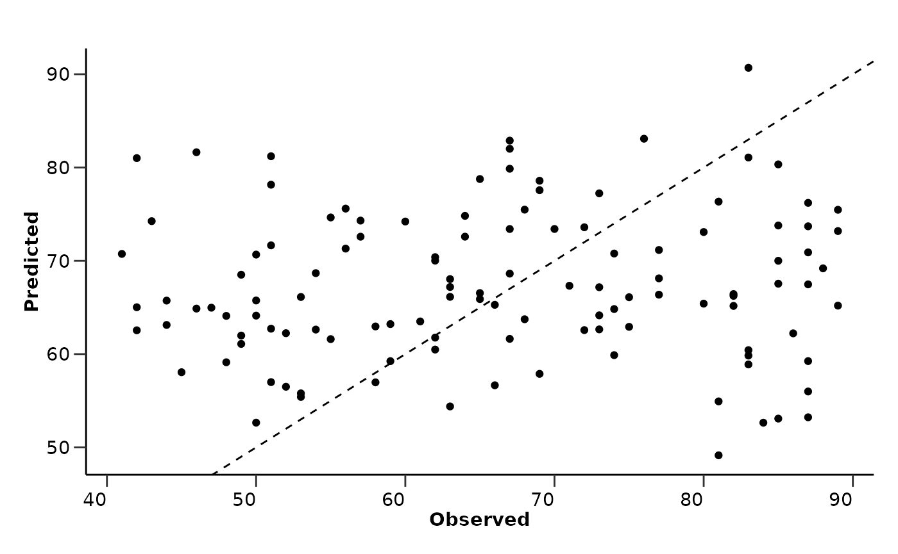

``` r

model_res$feat_imp_plot
```

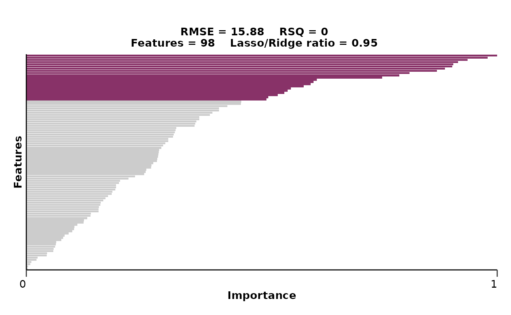

## Test the Model on new Data

Furthermore, we can validate our trained model in new data. For this
example we will not use another dataset, but we will split the data
initially to create a train and a validation set and then split the
train set to an inner train and a test set. We will use this second
split to initially train the model and then evaluate it with the
validation data. In a real case scenario, you can do either this, or use
a completely different dataset to check that the model generalizes
properly. We will use the
[`hd_model_test()`](https://kantonopoulos.github.io/HDAnalyzeR/reference/hd_model_test.md)
function to do this. Let’s see an example with the AML model.

``` r

# Split the data for training and validation sets
dat <- hd_obj$data
train_indices <- sample(1:nrow(dat), size = floor(0.8 * nrow(dat)))
train_data <- dat[train_indices, ]
validation_data <- dat[-train_indices, ]

hd_object_train <- hd_initialize(train_data, example_metadata, is_wide = TRUE)
hd_object_val <- hd_initialize(validation_data, example_metadata, is_wide = TRUE)

# Split the training set into training and inner test sets
split_obj <- hd_split_data(hd_object_train, variable = "Disease")

# Run the regularized regression model pipeline
model_object <- hd_model_rreg(split_obj,
                              variable = "Disease",
                              case = "AML",
                              grid_size = 2,
                              palette = "cancers12")

# Run the model evaluation pipeline
model_res <- hd_model_test(model_object, 
                           hd_object_train, 
                           hd_object_val, 
                           case = "AML", 
                           palette = "cancers12")

model_res$metrics
#> $accuracy
#> [1] 0.8717949
#> 
#> $sensitivity
#> [1] 0.6666667
#> 
#> $specificity
#> [1] 0.8888889
#> 
#> $auc
#> [1] 0.8899177
#> 
#> $confusion_matrix
#>           Truth
#> Prediction  0  1
#>          0 96  3
#>          1 12  6
model_res$test_metrics  # Results from the validation set
#> $accuracy
#> [1] 0.8220339
#> 
#> $sensitivity
#> [1] 0.9166667
#> 
#> $specificity
#> [1] 0.8113208
#> 
#> $auc
#> [1] 0.9040881
#> 
#> $confusion_matrix
#>           Truth
#> Prediction  0  1
#>          0 86  1
#>          1 20 11
model_res$roc_curve
```

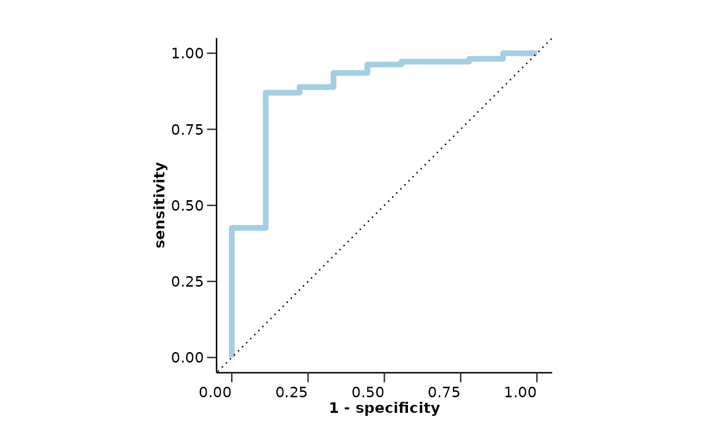

``` r

model_res$test_roc_curve  # Results from the validation set
```

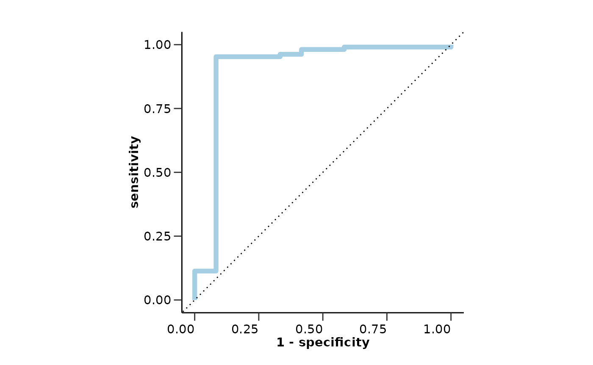

## Summarizing Results from Multiple Binary Models

To summarize the results for multiple binary models we can use the
[`hd_plot_model_summary()`](https://kantonopoulos.github.io/HDAnalyzeR/reference/hd_plot_model_summary.md)
function. We can create models of different cases and compare them.
Let’s run three different models for three different cancers and
summarize them.

> 📓 Do not forget that Ovarian Cancer is sex specific and we should
> consider run the analysis only with samples of that sex. We can easily
> integrate that into our pipeline using the
> [`hd_filter()`](https://kantonopoulos.github.io/HDAnalyzeR/reference/hd_filter.md)
> function.

``` r

split_obj <- hd_split_data(hd_obj, variable = "Disease")

model_aml <- hd_model_rreg(split_obj, case = "AML", cv_sets = 3, grid_size = 5, verbose = FALSE)

model_gliom <- hd_model_rreg(split_obj, case = "GLIOM", cv_sets = 3, grid_size = 5, verbose = FALSE)

split_obj_sex <- hd_split_data(hd_obj |> hd_filter(variable = "Sex", values = "F", flag = "k"),
                               variable = "Disease",
                               ratio = 0.8)

model_ovc <- hd_model_rreg(split_obj_sex, case = "OVC", cv_sets = 3, grid_size = 5, verbose = FALSE)
```

``` r

model_summary_res <- hd_plot_model_summary(list("AML" = model_aml, 
                                                "GLIOM" = model_gliom, 
                                                "OVC" = model_ovc), 
                                           class_palette = "cancers12")
```

``` r

model_summary_res$metrics_barplot
```

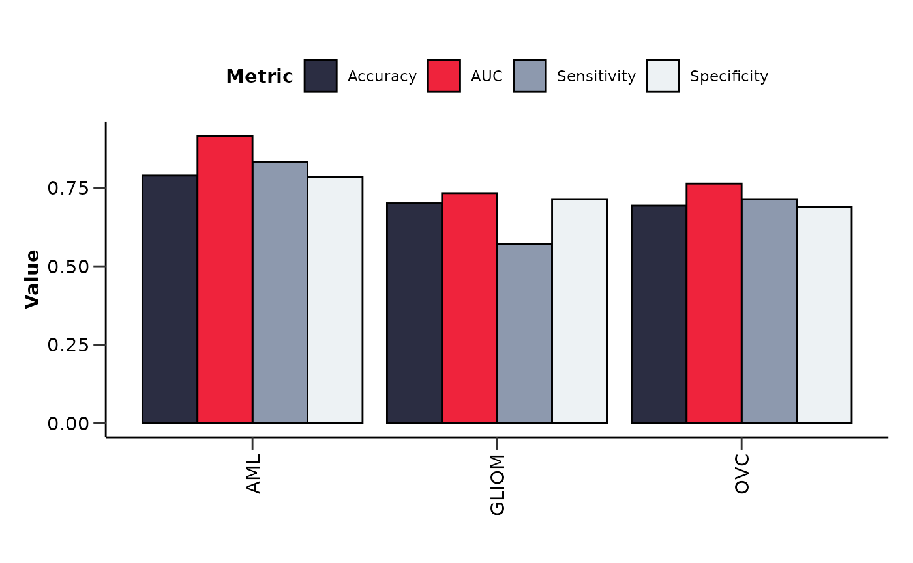

``` r

model_summary_res$features_barplot
```

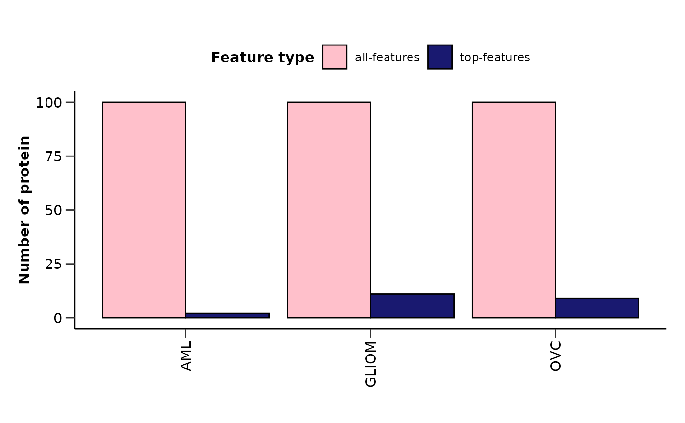

``` r

model_summary_res$upset_plot_features
```

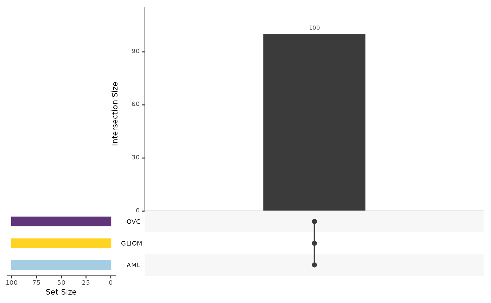

In case we have one case and multiple controls we can use the
[`hd_plot_feature_heatmap()`](https://kantonopoulos.github.io/HDAnalyzeR/reference/hd_plot_feature_heatmap.md)
function to visualize the protein features in a heatmap. This function
is useful as we can easily see if the same features are important in
multiple models. Let’s see an example with the AML model and 3 different
controls groups. We will combine DE results of the same comparisons.

``` r

model_cll <- hd_model_rreg(split_obj, case = "AML", control = "CLL", cv_sets = 3, grid_size = 5, verbose = FALSE)

model_blood <- hd_model_rreg(split_obj, 
                             case = "AML", 
                             control = c("CLL", "MYEL", "LYMPH"), 
                             cv_sets = 3, 
                             grid_size = 5, 
                             verbose = FALSE)

model_all <- hd_model_rreg(split_obj, case = "AML", cv_sets = 3, grid_size = 5, verbose = FALSE)

de_cll <- hd_de_limma(hd_obj, case = "AML", control = "CLL", correct = c("Sex", "Age"))

de_blood <- hd_de_limma(hd_obj, 
                              case = "AML", 
                              control = c("CLL", "MYEL", "LYMPH"), 
                              correct = c("Sex", "Age"))

de_all <- hd_de_limma(hd_obj, case = "AML", correct = c("Sex", "Age"))
```

``` r

hd_plot_feature_heatmap(de_results = list("CLL" = de_cll, 
                                          "Blood" = de_blood, 
                                          "All" = de_all), 
                        model_results = list("CLL" = model_cll, 
                                             "Blood" = model_blood, 
                                             "All" = model_all), 
                        order_by = "CLL")
```

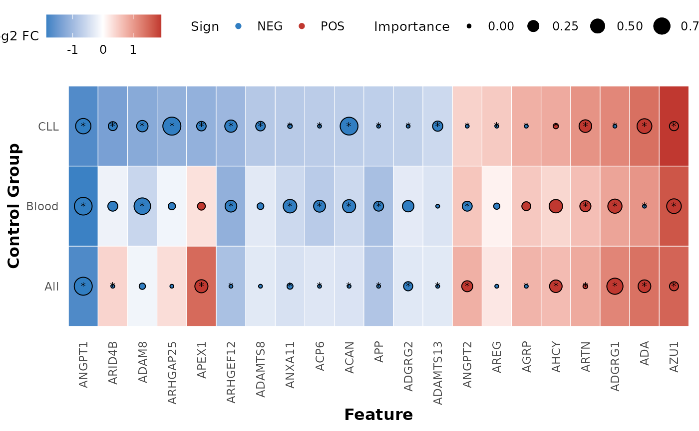

Finally, we can use the
[`hd_plot_feature_network()`](https://kantonopoulos.github.io/HDAnalyzeR/reference/hd_plot_feature_network.md)
function to visualize the protein features in a network. This function
is useful as we can easily see the connections between the features and
the importance of each feature in the model. Let’s see an example with
the same 3 models from before.

``` r

feature_panel <- model_aml[["features"]] |>
  filter(Scaled_Importance > 0.5) |>
  mutate(Class = "AML") |>
  bind_rows(model_gliom[["features"]] |>
              filter(Scaled_Importance > 0.5) |>
              mutate(Class = "GLIOM"),
            model_ovc[["features"]] |>
              filter(Scaled_Importance > 0.5) |>
              mutate(Class = "OVC"))

print(head(feature_panel))  # Preview of the feature panel
#> # A tibble: 6 × 5
#>   Feature  Importance Sign  Scaled_Importance Class
#>   <fct>         <dbl> <chr>             <dbl> <chr>
#> 1 ANGPT1        3.61  NEG               1     AML  
#> 2 ADGRG1        1.98  POS               0.548 AML  
#> 3 ADAMTS16      0.598 NEG               1     GLIOM
#> 4 ANGPTL7       0.421 POS               0.704 GLIOM
#> 5 APEX1         0.418 NEG               0.699 GLIOM
#> 6 ATF2          0.349 POS               0.583 GLIOM

hd_plot_feature_network(feature_panel,
                        plot_color = "Scaled_Importance",
                        class_palette = "cancers12")
```

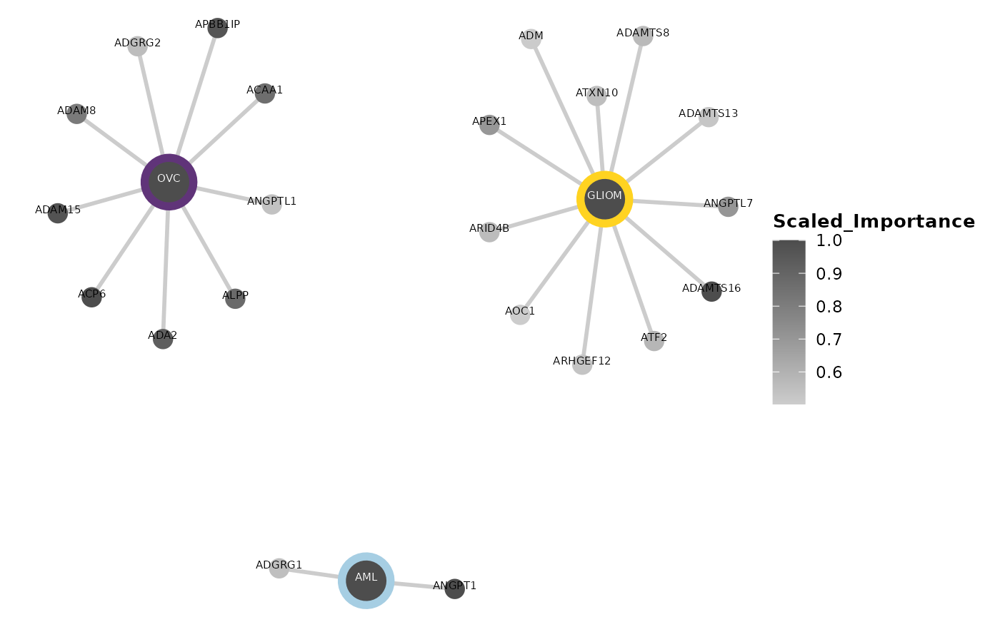

> 📓 Remember that these data are a dummy-dataset with artificial data
> and the results in this guide should not be interpreted as real
> results. The purpose of this vignette is to show you how to use the
> package and its functions.

``` r

sessionInfo()
#> R version 4.6.1 (2026-06-24)
#> Platform: x86_64-pc-linux-gnu
#> Running under: Ubuntu 24.04.4 LTS
#> 
#> Matrix products: default
#> BLAS:   /usr/lib/x86_64-linux-gnu/openblas-pthread/libblas.so.3 
#> LAPACK: /usr/lib/x86_64-linux-gnu/openblas-pthread/libopenblasp-r0.3.26.so;  LAPACK version 3.12.0
#> 
#> locale:
#>  [1] LC_CTYPE=C.UTF-8       LC_NUMERIC=C           LC_TIME=C.UTF-8       
#>  [4] LC_COLLATE=C.UTF-8     LC_MONETARY=C.UTF-8    LC_MESSAGES=C.UTF-8   
#>  [7] LC_PAPER=C.UTF-8       LC_NAME=C              LC_ADDRESS=C          
#> [10] LC_TELEPHONE=C         LC_MEASUREMENT=C.UTF-8 LC_IDENTIFICATION=C   
#> 
#> time zone: UTC
#> tzcode source: system (glibc)
#> 
#> attached base packages:
#> [1] stats     graphics  grDevices utils     datasets  methods   base     
#> 
#> other attached packages:
#> [1] dplyr_1.2.1      glmnet_5.0       Matrix_1.7-5     HDAnalyzeR_1.1.0
#> 
#> loaded via a namespace (and not attached):
#>   [1] matrixStats_1.5.0       fs_2.1.0                enrichplot_1.32.0      
#>   [4] fontawesome_0.5.3       lubridate_1.9.5         sparsevctrs_0.3.6      
#>   [7] DiceDesign_1.10         httr_1.4.8              RColorBrewer_1.1-3     
#>  [10] doParallel_1.0.17       prabclus_2.3-5          dynamicTreeCut_1.63-1  
#>  [13] backports_1.5.1         tools_4.6.1             doRNG_1.8.6.3          
#>  [16] utf8_1.2.6              R6_2.6.1                mgcv_1.9-4             
#>  [19] lazyeval_0.2.3          uwot_0.2.4              yardstick_1.4.0        
#>  [22] withr_3.0.3             gridExtra_2.3.1         downlit_0.4.5          
#>  [25] preprocessCore_1.74.0   WGCNA_1.74              cli_3.6.6              
#>  [28] Biobase_2.72.0          textshaping_1.0.5       scatterpie_0.2.6       
#>  [31] labeling_0.4.3          sass_0.4.10             diptest_0.77-2         
#>  [34] S7_0.2.2                robustbase_0.99-7       randomForest_4.7-1.2   
#>  [37] ggridges_0.5.7          tune_2.1.0              askpass_1.2.1          
#>  [40] pkgdown_2.2.1           systemfonts_1.3.2       yulab.utils_0.2.4      
#>  [43] foreign_0.8-91          gson_0.2.1              DOSE_4.6.0             
#>  [46] parallelly_1.48.0       itertools_0.1-3         limma_3.68.5           
#>  [49] impute_1.86.0           rstudioapi_0.19.0       RSQLite_3.53.3         
#>  [52] shape_1.4.6.1           generics_0.1.4          gridGraphics_0.5-1     
#>  [55] GO.db_3.23.1            ggbeeswarm_0.7.3        fansi_1.0.7            
#>  [58] S4Vectors_0.50.1        lifecycle_1.0.5         whisker_0.4.1          
#>  [61] yaml_2.3.12             recipes_1.3.3           qvalue_2.44.0          
#>  [64] grid_4.6.1              blob_1.3.0              crayon_1.5.3           
#>  [67] ggtangle_0.1.2          lattice_0.22-9          KEGGREST_1.52.2        
#>  [70] pillar_1.11.1           knitr_1.51              fpc_2.2-14             
#>  [73] future.apply_1.20.2     codetools_0.2-20        glue_1.8.1             
#>  [76] ggiraph_0.9.6           rsample_1.3.2           ggfun_0.2.1            
#>  [79] fontLiberation_0.1.0    data.table_1.18.4       vctrs_0.7.3            
#>  [82] png_0.1-9               treeio_1.36.1           Rdpack_2.6.6           
#>  [85] gtable_0.3.6            kernlab_0.9-33          cachem_1.1.0           
#>  [88] gower_1.0.2             xfun_0.60               rbibutils_2.4.1        
#>  [91] prodlim_2026.03.11      tidygraph_1.3.1         Seqinfo_1.2.0          
#>  [94] survival_3.8-6          timeDate_4052.112       aisdk_1.4.12           
#>  [97] pheatmap_1.0.13         iterators_1.0.14        hardhat_1.4.3          
#> [100] lava_1.9.2              statmod_1.5.2           ipred_0.9-15           
#> [103] nlme_3.1-169            ggtree_4.2.0            bit64_4.8.2            
#> [106] fontquiver_0.2.1        RcppAnnoy_0.0.23        UpSetR_1.4.1           
#> [109] bslib_0.12.0            vipor_0.4.7             otel_0.2.0             
#> [112] rpart_4.1.27            colorspace_2.1-3        Hmisc_5.2-6            
#> [115] BiocGenerics_0.58.1     DBI_1.3.0               nnet_7.3-20            
#> [118] ppsr_0.0.5              tidyselect_1.2.1        processx_3.9.0         
#> [121] bit_4.6.0               compiler_4.6.1          curl_7.1.0             
#> [124] httr2_1.3.0             htmlTable_2.5.0         xml2_1.6.0             
#> [127] desc_1.4.3              fontBitstreamVera_0.1.1 checkmate_2.3.4        
#> [130] scales_1.4.0            DEoptimR_1.2-0          callr_3.8.0            
#> [133] rappdirs_0.3.4          stringr_1.6.0           digest_0.6.39          
#> [136] rmarkdown_2.31          XVector_0.52.0          base64enc_0.1-6        
#> [139] htmltools_0.5.9         pkgconfig_2.0.3         fastmap_1.2.0          
#> [142] rlang_1.3.0             htmlwidgets_1.6.4       farver_2.1.2           
#> [145] jquerylib_0.1.4         jsonlite_2.0.0          mclust_6.1.3           
#> [148] GOSemSim_2.38.3         magrittr_2.0.5          Formula_1.2-6          
#> [151] modeltools_0.2-24       ggplotify_0.1.3         patchwork_1.3.2        
#> [154] tailor_0.1.0            Rcpp_1.1.2              viridis_0.6.5          
#> [157] ape_5.8-1               ggnewscale_0.5.2        gdtools_0.5.1          
#> [160] furrr_0.4.0             stringi_1.8.9           ggraph_2.2.2           
#> [163] MASS_7.3-65             plyr_1.8.9              org.Hs.eg.db_3.23.1    
#> [166] embed_1.2.2             flexmix_2.3-20          tidyheatmaps_0.2.1     
#> [169] parallel_4.6.1          listenv_1.0.0           ggrepel_0.9.8          
#> [172] graphlayouts_1.2.5      Biostrings_2.80.1       splines_4.6.1          
#> [175] ps_1.9.3                fastcluster_1.3.0       igraph_2.3.3           
#> [178] ranger_0.18.0           enrichit_0.2.1          dials_1.4.4            
#> [181] rngtools_1.5.2          reshape2_1.4.5          parsnip_1.6.0          
#> [184] stats4_4.6.1            evaluate_1.0.5          foreach_1.5.2          
#> [187] missForest_1.6.1        tweenr_2.0.3            tidyr_1.3.2            
#> [190] openssl_2.4.2           purrr_1.2.2             polyclip_1.10-7        
#> [193] future_1.75.0           ggplot2_4.0.3           ggforce_0.5.0          
#> [196] easyPubMed_3.1.6        RSpectra_0.16-2         tidytree_0.4.8         
#> [199] tidydr_0.0.6            viridisLite_0.4.3       class_7.3-23           
#> [202] ragg_1.5.2              tibble_3.3.1            clusterProfiler_4.20.0 
#> [205] aplot_0.3.1             beeswarm_0.4.0          memoise_2.0.1          
#> [208] AnnotationDbi_1.74.0    IRanges_2.46.0          cluster_2.1.8.2        
#> [211] workflows_1.3.0         timechange_0.4.0        globals_0.19.1
```
