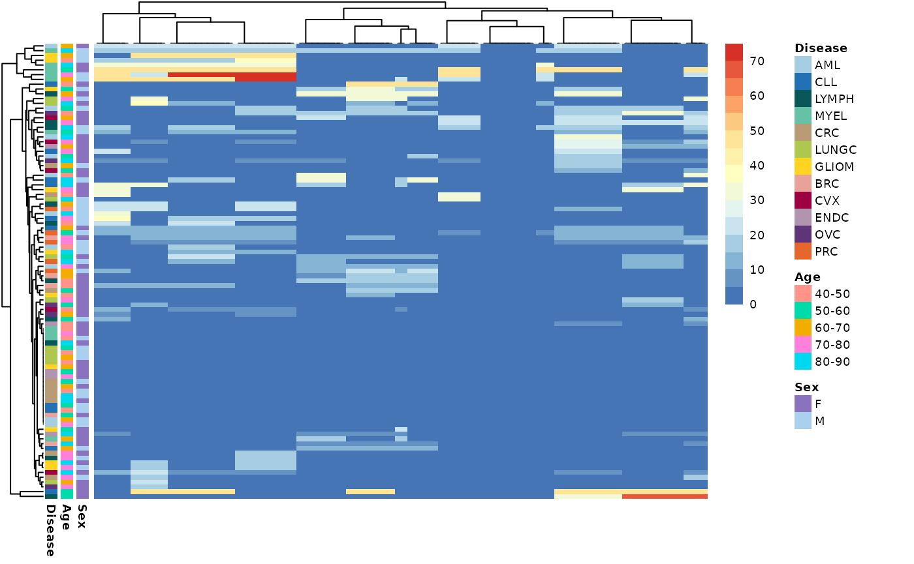
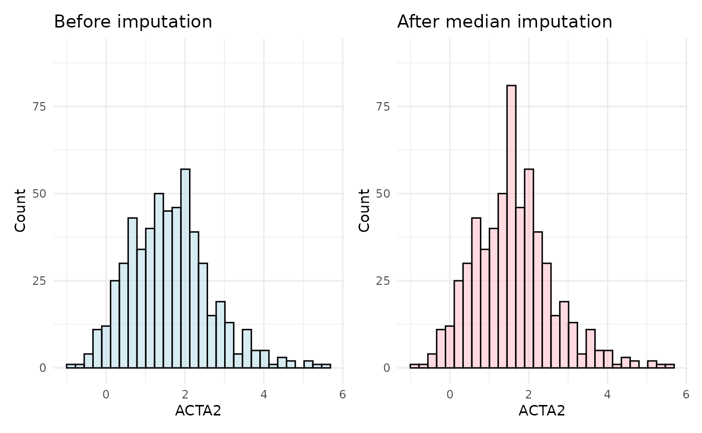
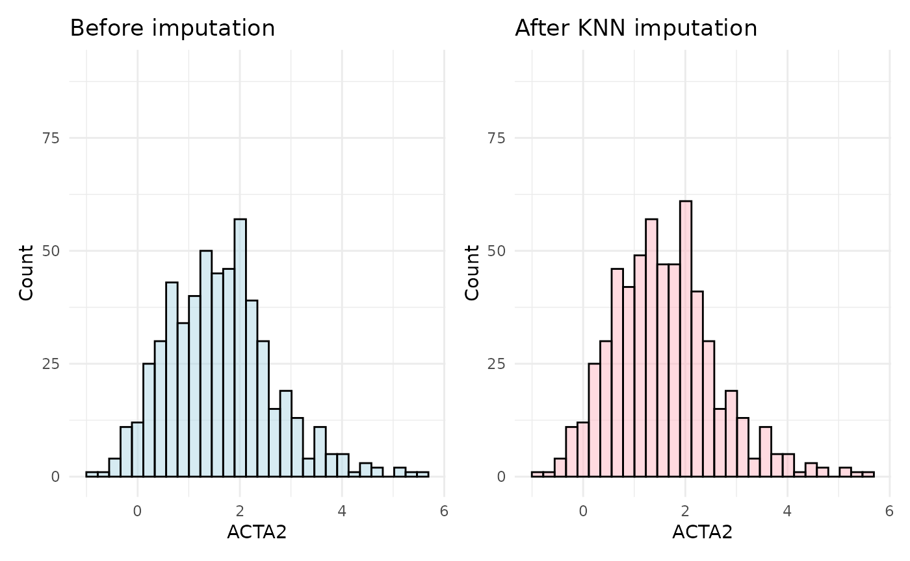
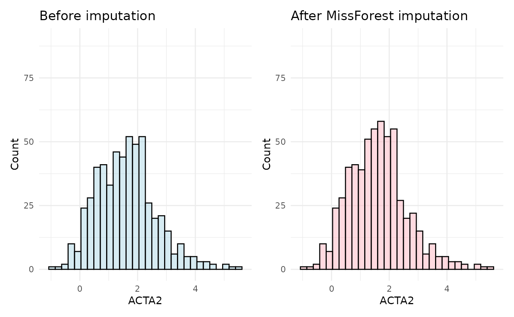
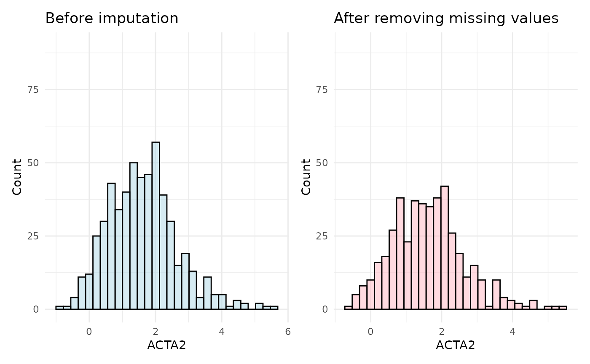

# Data Imputation

This vignette will guide you to the different imputation methods
HDAnalyzeR offers. First of all, we will load the package, as well as
dplyr, ggplot2 and patchwork for data manipulation and visualization.

``` r

library(HDAnalyzeR)
library(dplyr)
library(ggplot2)
library(patchwork)
```

## Loading the Data

Let’s start with loading the example data and metadata that come with
the package and initialize the HDAnalyzeR object.

``` r

hd_obj <- hd_initialize(dat = example_data, 
                        metadata = example_metadata, 
                        is_wide = FALSE, 
                        sample_id = "DAid",
                        var_name = "Assay",
                        value_name = "NPX")
```

## Explore Missing Values

We can simply check our data for NA values by using the
[`hd_qc_summary()`](https://kantonopoulos.github.io/HDAnalyzeR/reference/hd_qc_summary.md)
as we did in previous vignettes. This time we will use something
specific to NA values, the
[`hd_na_search()`](https://kantonopoulos.github.io/HDAnalyzeR/reference/hd_na_search.md)
function. This function will return a summary heatmap showing the
distribution of NA values across the data and metadata variables. This
function is ideal to dive into the missing values and understand if
there are any patterns in the missing data. This is important in order
to decide how to handle them (e.g., impute or remove).

``` r

na_res <- hd_na_search(hd_obj,
                       annotation_vars = c("Sex", "Age", "Disease"),
                       palette = list(Disease = "cancers12",
                                      Sex = "sex"),
                       x_labels = FALSE,
                       y_labels = FALSE)

na_res$na_heatmap
```



In this case, we can see that the NA values are generally spread across
the different Assays, samples and metadata variables. There is a higher
concentration of missing values in Myeloma that may require further
investigation. In our case, we will try impute them!

## Imputation Methods

### Median Imputation

We will start the imputation with the simplest and fastest method, which
is the median imputation by using the
[`hd_impute_median()`](https://kantonopoulos.github.io/HDAnalyzeR/reference/hd_impute_median.md).
After the imputation, we will check the sample distribution of a random
Assay that contains missing values to see if these values are imputed
logically. In a real case, this check should be done to more than just
one assay.

``` r

imputed_hd_obj <- hd_impute_median(hd_obj, verbose = FALSE)

plot_before <- hd_obj$data |> 
  ggplot(aes(x = ACTA2)) +
  geom_histogram(fill = "lightblue", color = "black", alpha = 0.5, bins = 30) +
  labs(title = "Before imputation",
       x = "ACTA2", y = "Count") +
  ylim(0, 90) +
  theme_minimal()

plot_after <- imputed_hd_obj$data |> 
  ggplot(aes(x = ACTA2)) +
  geom_histogram(fill = "lightpink", color = "black", alpha = 0.5, bins = 30) +
  labs(title = "After median imputation",
       x = "ACTA2", y = "Count") +
  ylim(0, 90) +
  theme_minimal()

plot_before + plot_after
```



As observed in the plots, the distribution of the ACTA2 assay shifts
after imputation, with an exaggerated median value in the imputed data.
This highlights a key drawback of median imputation: the more missing
values there are, the greater the potential bias.

### KNN Imputation

A better approach is to use the
[`hd_impute_knn()`](https://kantonopoulos.github.io/HDAnalyzeR/reference/hd_impute_knn.md)
with 5 neighbors, which imputes missing values based on the 5-nearest
neighbors. We will use the same assay to compare the imputed data with
the original data.

``` r

imputed_hd_obj <- hd_impute_knn(hd_obj, k = 5, verbose = FALSE)

plot_before <- hd_obj$data |> 
  ggplot(aes(x = ACTA2)) +
  geom_histogram(fill = "lightblue", color = "black", alpha = 0.5, bins = 30) +
  labs(title = "Before imputation",
       x = "ACTA2", y = "Count") +
  ylim(0, 90) +
  theme_minimal()

plot_after <- imputed_hd_obj$data |>
  ggplot(aes(x = ACTA2)) +
  geom_histogram(fill = "lightpink", color = "black", alpha = 0.5, bins = 30) +
  labs(title = "After KNN imputation",
       x = "ACTA2", y = "Count") +
  ylim(0, 90) +
  theme_minimal()

plot_before + plot_after
```



In this case, the distribution of the ACTA2 assay after imputation is
more similar to the original distribution. This is because the KNN
imputation method uses the nearest neighbors to impute missing values,
which is more accurate and representative than median imputation.

### MissForest Imputation

Finally, we will use the
[`hd_impute_missForest()`](https://kantonopoulos.github.io/HDAnalyzeR/reference/hd_impute_missForest.md)
method, which uses the random forest algorithm to impute missing values.
We will use the default values for the number of trees and the number of
iterations.

``` r

imputed_hd_obj <- hd_impute_missForest(hd_obj, verbose = FALSE)

plot_before <- hd_obj$data |> 
  ggplot(aes(x = ACTA2)) +
  geom_histogram(fill = "lightblue", color = "black", alpha = 0.5, bins = 30) +
  labs(title = "Before imputation",
       x = "ACTA2", y = "Count") +
  ylim(0, 90) +
  theme_minimal()

plot_after <- imputed_hd_obj$data |>
  ggplot(aes(x = ACTA2)) +
  geom_histogram(fill = "lightpink", color = "black", alpha = 0.5, bins = 30) +
  labs(title = "After MissForest imputation",
       x = "ACTA2", y = "Count") +
  ylim(0, 90) +
  theme_minimal()

plot_before + plot_after
```



The MissForest imputation method is usually the most accurate and also
very robust, as it uses the complex random forest algorithm to impute
missing values. This method is particularly useful for large datasets
with complex relationships between variables. On the other hand, it is
by far the most computationally expensive and it would help parallelize
it. You can do that by creating and registering a cluster with a package
like `doParallel` and then setting the `parallelize` argument to
“forests” or “variables”.

> 📓 All methods assume that the data is missing at random, which is a
> common assumption in imputation methods. If the data are missing in a
> biased way (either technical or biological), the imputation methods
> may introduce bias into the data. In such cases, it is important to
> carefully consider the way the data were collected and what they
> represent.

## Removing Missing Values instead of Imputing

If for any reason you do not want to impute the data, you can use the
[`hd_omit_na()`](https://kantonopoulos.github.io/HDAnalyzeR/reference/hd_omit_na.md)
function to easily remove the rows with missing values in specific
variables. In this example, we will remove all rows with missing values
in any of the assays.

``` r

imputed_hd_obj <- hd_omit_na(hd_obj)

plot_before <- hd_obj$data |> 
  ggplot(aes(x = ACTA2)) +
  geom_histogram(fill = "lightblue", color = "black", alpha = 0.5, bins = 30) +
  labs(title = "Before imputation",
       x = "ACTA2", y = "Count") +
  ylim(0, 90) +
  theme_minimal()

plot_after <- imputed_hd_obj$data |>
  ggplot(aes(x = ACTA2)) +
  geom_histogram(fill = "lightpink", color = "black", alpha = 0.5, bins = 30) +
  labs(title = "After removing missing values",
       x = "ACTA2", y = "Count") +
  ylim(0, 90) +
  theme_minimal()

plot_before + plot_after
```



``` r


# Data after removing missing values only in specific columns
res <- hd_omit_na(hd_obj, columns = "AARSD1")
res$data
#> # A tibble: 552 × 101
#>    DAid    AARSD1  ABL1  ACAA1    ACAN    ACE2  ACOX1    ACP5    ACP6 ACTA2
#>    <chr>    <dbl> <dbl>  <dbl>   <dbl>   <dbl>  <dbl>   <dbl>   <dbl> <dbl>
#>  1 DA00001   3.39 2.76   1.71   0.0333  1.76   -0.919  1.54    2.15   2.81 
#>  2 DA00002   1.42 1.25  -0.816 -0.459   0.826  -0.902  0.647   1.30   0.798
#>  3 DA00004   3.41 3.38   1.69  NA       1.52   NA      0.841   0.582  1.70 
#>  4 DA00005   5.01 5.05   0.128  0.401  -0.933  -0.584  0.0265  1.16   2.73 
#>  5 DA00006   6.83 1.18  -1.74  -0.156   1.53   -0.721  0.620   0.527  0.772
#>  6 DA00008   2.78 0.812 -0.552  0.982  -0.101  -0.304  0.376  -0.826  1.52 
#>  7 DA00009   4.39 3.34  -0.452 -0.868   0.395   1.71   1.49   -0.0285 0.200
#>  8 DA00010   1.83 1.21  -0.912 -1.04   -0.0918 -0.304  1.69    0.0920 2.04 
#>  9 DA00011   3.48 4.96   3.50  -0.338   4.48    1.26   2.18    1.62   1.79 
#> 10 DA00012   4.31 0.710 -1.44  -0.218  -0.469  -0.361 -0.0714 -1.30   2.86 
#> # ℹ 542 more rows
#> # ℹ 91 more variables: ACTN4 <dbl>, ACY1 <dbl>, ADA <dbl>, ADA2 <dbl>,
#> #   ADAM15 <dbl>, ADAM23 <dbl>, ADAM8 <dbl>, ADAMTS13 <dbl>, ADAMTS15 <dbl>,
#> #   ADAMTS16 <dbl>, ADAMTS8 <dbl>, ADCYAP1R1 <dbl>, ADGRE2 <dbl>, ADGRE5 <dbl>,
#> #   ADGRG1 <dbl>, ADGRG2 <dbl>, ADH4 <dbl>, ADM <dbl>, AGER <dbl>, AGR2 <dbl>,
#> #   AGR3 <dbl>, AGRN <dbl>, AGRP <dbl>, AGXT <dbl>, AHCY <dbl>, AHSP <dbl>,
#> #   AIF1 <dbl>, AIFM1 <dbl>, AK1 <dbl>, AKR1B1 <dbl>, AKR1C4 <dbl>, …
```

In this vignette we showed that via HDAnalyzeR you can impute your data
with different methods, each of them with its own advantages and
drawbacks. You can choose the method that best fits your data and your
analysis needs. When using KNN or MissForest imputation methods, you
should experiment with the parameters and look at the distributions of
assays before and after to pick the most suitable.

> 📓 Remember that these data are a dummy-dataset with artificial data
> and the results in this guide should not be interpreted as real
> results. The purpose of this vignette is to show you how to use the
> package and its functions.

``` r

sessionInfo()
#> R version 4.6.1 (2026-06-24)
#> Platform: x86_64-pc-linux-gnu
#> Running under: Ubuntu 24.04.4 LTS
#> 
#> Matrix products: default
#> BLAS:   /usr/lib/x86_64-linux-gnu/openblas-pthread/libblas.so.3 
#> LAPACK: /usr/lib/x86_64-linux-gnu/openblas-pthread/libopenblasp-r0.3.26.so;  LAPACK version 3.12.0
#> 
#> locale:
#>  [1] LC_CTYPE=C.UTF-8       LC_NUMERIC=C           LC_TIME=C.UTF-8       
#>  [4] LC_COLLATE=C.UTF-8     LC_MONETARY=C.UTF-8    LC_MESSAGES=C.UTF-8   
#>  [7] LC_PAPER=C.UTF-8       LC_NAME=C              LC_ADDRESS=C          
#> [10] LC_TELEPHONE=C         LC_MEASUREMENT=C.UTF-8 LC_IDENTIFICATION=C   
#> 
#> time zone: UTC
#> tzcode source: system (glibc)
#> 
#> attached base packages:
#> [1] stats     graphics  grDevices utils     datasets  methods   base     
#> 
#> other attached packages:
#> [1] patchwork_1.3.2  ggplot2_4.0.3    dplyr_1.2.1      glmnet_5.0      
#> [5] Matrix_1.7-5     HDAnalyzeR_1.1.0
#> 
#> loaded via a namespace (and not attached):
#>   [1] matrixStats_1.5.0       fs_2.1.0                enrichplot_1.32.0      
#>   [4] fontawesome_0.5.3       lubridate_1.9.5         sparsevctrs_0.3.6      
#>   [7] DiceDesign_1.10         httr_1.4.8              RColorBrewer_1.1-3     
#>  [10] doParallel_1.0.17       prabclus_2.3-5          dynamicTreeCut_1.63-1  
#>  [13] backports_1.5.1         tools_4.6.1             doRNG_1.8.6.3          
#>  [16] utf8_1.2.6              R6_2.6.1                mgcv_1.9-4             
#>  [19] lazyeval_0.2.3          uwot_0.2.4              yardstick_1.4.0        
#>  [22] withr_3.0.3             gridExtra_2.3.1         downlit_0.4.5          
#>  [25] preprocessCore_1.74.0   WGCNA_1.74              cli_3.6.6              
#>  [28] Biobase_2.72.0          textshaping_1.0.5       scatterpie_0.2.6       
#>  [31] labeling_0.4.3          sass_0.4.10             diptest_0.77-2         
#>  [34] S7_0.2.2                robustbase_0.99-7       randomForest_4.7-1.2   
#>  [37] ggridges_0.5.7          tune_2.1.0              askpass_1.2.1          
#>  [40] pkgdown_2.2.1           systemfonts_1.3.2       yulab.utils_0.2.4      
#>  [43] foreign_0.8-91          gson_0.2.1              DOSE_4.6.0             
#>  [46] parallelly_1.48.0       itertools_0.1-3         limma_3.68.5           
#>  [49] impute_1.86.0           rstudioapi_0.19.0       RSQLite_3.53.3         
#>  [52] shape_1.4.6.1           generics_0.1.4          gridGraphics_0.5-1     
#>  [55] GO.db_3.23.1            ggbeeswarm_0.7.3        fansi_1.0.7            
#>  [58] S4Vectors_0.50.1        lifecycle_1.0.5         whisker_0.4.1          
#>  [61] yaml_2.3.12             recipes_1.3.3           qvalue_2.44.0          
#>  [64] grid_4.6.1              blob_1.3.0              crayon_1.5.3           
#>  [67] ggtangle_0.1.2          lattice_0.22-9          KEGGREST_1.52.2        
#>  [70] pillar_1.11.1           knitr_1.51              fpc_2.2-14             
#>  [73] future.apply_1.20.2     codetools_0.2-20        glue_1.8.1             
#>  [76] ggiraph_0.9.6           rsample_1.3.2           ggfun_0.2.1            
#>  [79] fontLiberation_0.1.0    data.table_1.18.4       vctrs_0.7.3            
#>  [82] png_0.1-9               treeio_1.36.1           Rdpack_2.6.6           
#>  [85] gtable_0.3.6            kernlab_0.9-33          cachem_1.1.0           
#>  [88] gower_1.0.2             xfun_0.60               rbibutils_2.4.1        
#>  [91] prodlim_2026.03.11      tidygraph_1.3.1         Seqinfo_1.2.0          
#>  [94] survival_3.8-6          timeDate_4052.112       aisdk_1.4.12           
#>  [97] pheatmap_1.0.13         iterators_1.0.14        hardhat_1.4.3          
#> [100] lava_1.9.2              statmod_1.5.2           ipred_0.9-15           
#> [103] nlme_3.1-169            ggtree_4.2.0            bit64_4.8.2            
#> [106] fontquiver_0.2.1        RcppAnnoy_0.0.23        UpSetR_1.4.1           
#> [109] bslib_0.12.0            vipor_0.4.7             otel_0.2.0             
#> [112] rpart_4.1.27            colorspace_2.1-3        Hmisc_5.2-6            
#> [115] BiocGenerics_0.58.1     DBI_1.3.0               nnet_7.3-20            
#> [118] ppsr_0.0.5              tidyselect_1.2.1        processx_3.9.0         
#> [121] bit_4.6.0               compiler_4.6.1          curl_7.1.0             
#> [124] httr2_1.3.0             htmlTable_2.5.0         xml2_1.6.0             
#> [127] desc_1.4.3              fontBitstreamVera_0.1.1 checkmate_2.3.4        
#> [130] scales_1.4.0            DEoptimR_1.2-0          callr_3.8.0            
#> [133] rappdirs_0.3.4          stringr_1.6.0           digest_0.6.39          
#> [136] rmarkdown_2.31          XVector_0.52.0          base64enc_0.1-6        
#> [139] htmltools_0.5.9         pkgconfig_2.0.3         fastmap_1.2.0          
#> [142] rlang_1.3.0             htmlwidgets_1.6.4       farver_2.1.2           
#> [145] jquerylib_0.1.4         jsonlite_2.0.0          mclust_6.1.3           
#> [148] GOSemSim_2.38.3         magrittr_2.0.5          Formula_1.2-6          
#> [151] modeltools_0.2-24       ggplotify_0.1.3         tailor_0.1.0           
#> [154] Rcpp_1.1.2              viridis_0.6.5           ape_5.8-1              
#> [157] ggnewscale_0.5.2        gdtools_0.5.1           furrr_0.4.0            
#> [160] stringi_1.8.9           ggraph_2.2.2            MASS_7.3-65            
#> [163] plyr_1.8.9              org.Hs.eg.db_3.23.1     embed_1.2.2            
#> [166] flexmix_2.3-20          tidyheatmaps_0.2.1      parallel_4.6.1         
#> [169] listenv_1.0.0           ggrepel_0.9.8           graphlayouts_1.2.5     
#> [172] Biostrings_2.80.1       splines_4.6.1           ps_1.9.3               
#> [175] fastcluster_1.3.0       igraph_2.3.3            ranger_0.18.0          
#> [178] enrichit_0.2.1          dials_1.4.4             rngtools_1.5.2         
#> [181] reshape2_1.4.5          parsnip_1.6.0           stats4_4.6.1           
#> [184] evaluate_1.0.5          foreach_1.5.2           missForest_1.6.1       
#> [187] tweenr_2.0.3            tidyr_1.3.2             openssl_2.4.2          
#> [190] purrr_1.2.2             polyclip_1.10-7         future_1.75.0          
#> [193] ggforce_0.5.0           easyPubMed_3.1.6        RSpectra_0.16-2        
#> [196] tidytree_0.4.8          tidydr_0.0.6            viridisLite_0.4.3      
#> [199] class_7.3-23            ragg_1.5.2              tibble_3.3.1           
#> [202] clusterProfiler_4.20.0  aplot_0.3.1             beeswarm_0.4.0         
#> [205] memoise_2.0.1           AnnotationDbi_1.74.0    IRanges_2.46.0         
#> [208] cluster_2.1.8.2         workflows_1.3.0         timechange_0.4.0       
#> [211] globals_0.19.1
```
