# Exploratory Data Analysis

This vignette will guide you through the initial steps of a proteomics
pipeline, which is the exploratory data analysis. Except from HDAnalyzeR
we will import viridis for the color palettes.

``` r

library(HDAnalyzeR)
library(viridis)
```

> 📓 This vignette is just a basic example of how to explore the data
> and perform dimensionality reduction to identify potential issues and
> trends. However, every dataset is different and may require different
> exploration techniques other than the ones contained in the package.

> ⚠️ Please make sure to preprocess the data and metadata before
> proceeding with the analysis. For the most common proteomics data
> formats, we provide some recommendations in the package documentation
> under articles “Data Preparation for HDAnalyzeR: What You Need Before
> Using the Package”.

## Loading the Data

Let’s start with loading the example data and metadata that come with
the package and initialize the HDAnalyzeR object.

``` r

hd_obj <- hd_initialize(dat = example_data, 
                        metadata = example_metadata, 
                        is_wide = FALSE, 
                        sample_id = "DAid",
                        var_name = "Assay",
                        value_name = "NPX")
```

## Exploratory Data Analysis

Now, we will perform an automated exploratory data analysis (QC check)
on the data.
[`hd_qc_summary()`](https://kantonopoulos.github.io/HDAnalyzeR/reference/hd_qc_summary.md)
will return the percentage of missing values for each column and row and
histograms of their distributions both for data and metadata, the
variable-variable (in this case protein-protein) correlation and the
metadata variable distributions.

> ⚠️ This should not be confused with the quality control of the data,
> which is a different process that is usually performed right after the
> proteomics experiments. The exploratory data analysis is a first step
> to understand the data and identify potential issues.

As `variable` we should pass the column name of the metadata that
contains the different classes, for example the case and control groups,
the different diseases, or the different stages of a disease. The
palettes are optional and can be used to color the plots of the metadata
variable distributions. You should pass a list with the variable name
and the palette name, for example list(Sex = c(“F” = “red”, “M” =
“blue”), Disease = “cancers12”). As you can see, the palettes can be
either a named vector or a character vector with the name of a palette
from the package. You can display all available HDAnalyzeR palettes by
running
[`hd_show_palettes()`](https://kantonopoulos.github.io/HDAnalyzeR/reference/hd_show_palettes.md).

``` r

qc_data <- hd_qc_summary(hd_obj, 
                         variable = "Disease", 
                         palette = list(Disease = "cancers12", Sex = "sex"), 
                         cor_threshold = 0.7)

qc_data$data_summary$na_col_hist
```

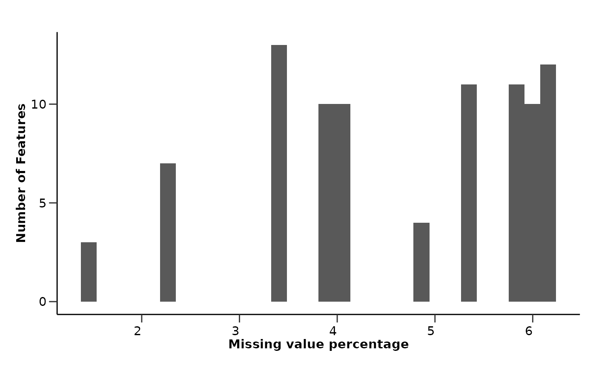

``` r

qc_data$data_summary$na_row_hist
```

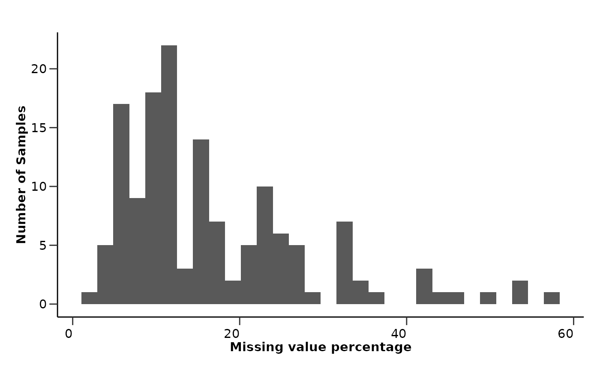

``` r

qc_data$data_summary$cor_heatmap
```

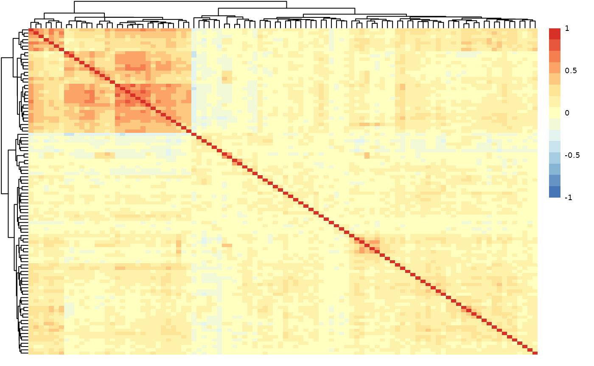

``` r

qc_data$metadata_summary$na_col_hist
```

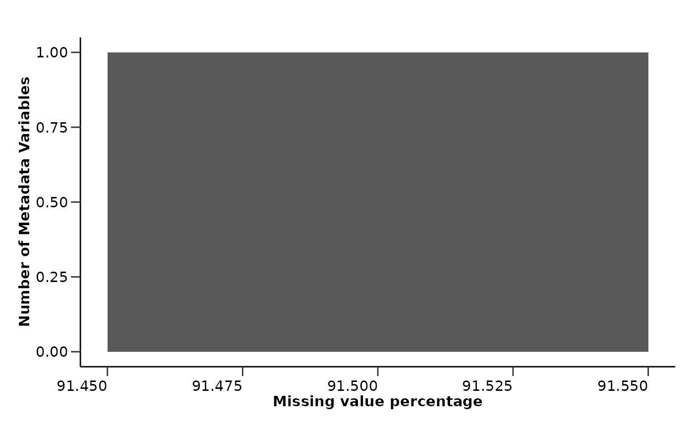

``` r

qc_data$metadata_summary$na_row_hist
```


``` r

qc_data$metadata_summary$Sex
```

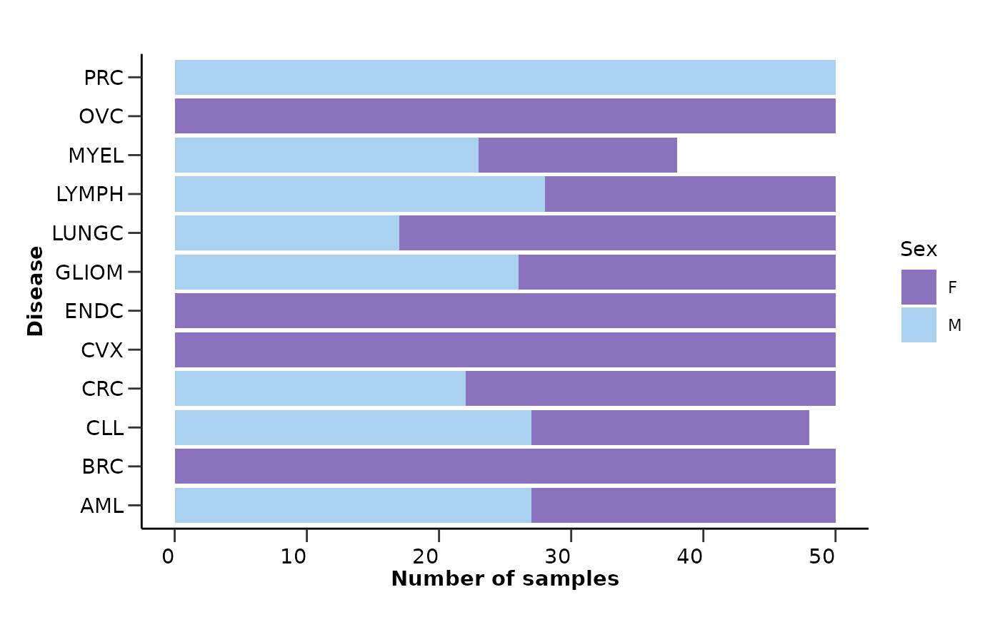

``` r

qc_data$metadata_summary$Stage
```

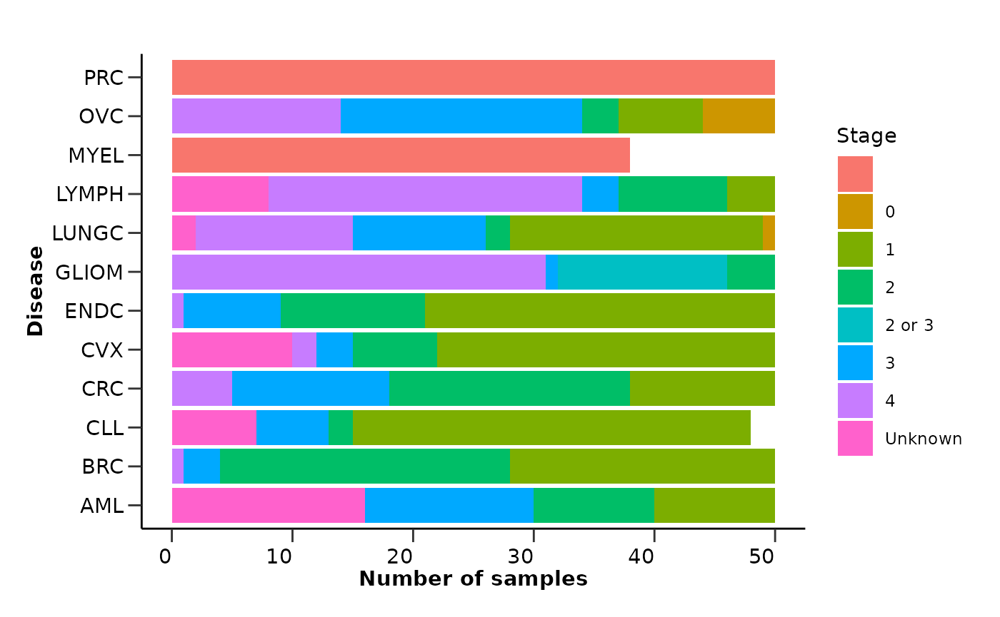

``` r

qc_data$metadata_summary$Age
```


``` r

qc_data$metadata_summary$BMI
```

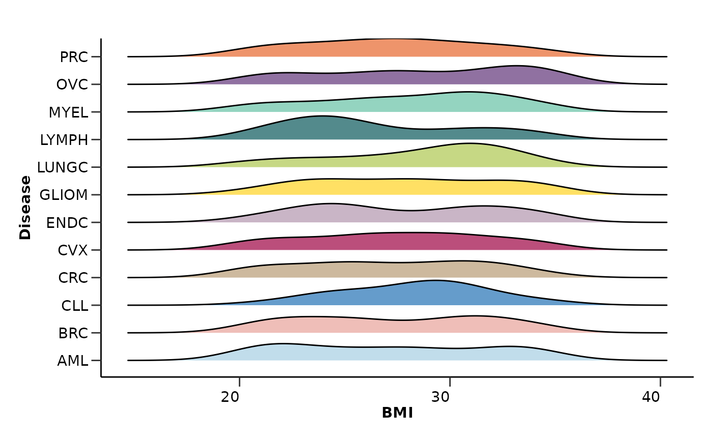

From the EDA results we can see that all assays have less than 10%
missing values, while only a few samples have more than 20% missing
values. The protein-protein correlation plot shows that there are no
extremely highly correlated proteins. Also, the metadata variable
`Stage` has a high percentage of missing values that are not correctly
stated as NA values but as “” or “Unknown”. These are only a few
examples of the information that we can extract from the EDA results.

Based on these we can take decisions on filtering samples with high
missing values, excluding whole assays and metadata variables from
statistical analysis.

## Dimensionality Reduction

Finally we will run a PCA and UMAP analysis on the data to check if the
data contain any outliers or cluster in an unexpected way. From the PCA
analysis we can also check how the variance in the data is explained by
the different principal components. In this example, we will color the
PCA plot based on `Disease`, while the UMAP plot based on `Age`.

The
[`hd_pca()`](https://kantonopoulos.github.io/HDAnalyzeR/reference/hd_pca.md)
and
[`hd_umap()`](https://kantonopoulos.github.io/HDAnalyzeR/reference/hd_umap.md)
functions will run the respective analysis while the
[`hd_plot_dim()`](https://kantonopoulos.github.io/HDAnalyzeR/reference/hd_plot_dim.md)
will plot the data on a 2D plane. For the PCA analysis we can also use
[`hd_plot_pca_loadings()`](https://kantonopoulos.github.io/HDAnalyzeR/reference/hd_plot_pca_loadings.md)
and
[`hd_plot_pca_variance()`](https://kantonopoulos.github.io/HDAnalyzeR/reference/hd_plot_pca_variance.md)
to plot the loadings of the different proteins on the principal
components and the variance explained by each principal component
respectively.

In the
[`hd_plot_dim()`](https://kantonopoulos.github.io/HDAnalyzeR/reference/hd_plot_dim.md)
function we can pass the `color` parameter to color the data points
based on a metadata variable. We should not forget to pass again the
hd_obj object to the `metadata` argument so the package can search the
metadata and identify the `color` variable.

``` r

pca_res <- hd_pca(hd_obj, components = 15) |> 
  hd_plot_dim(hd_obj, "PC1", "PC2", color = "Disease", palette = "cancers12", axis_variance = TRUE) |> 
  hd_plot_pca_loadings(displayed_pcs = 6, displayed_features = 10) |> 
  hd_plot_pca_variance()

head(pca_res$pca_res)
#> # A tibble: 6 × 16
#>   DAid     PC1     PC2    PC3    PC4    PC5    PC6     PC7    PC8    PC9    PC10
#>   <chr>  <dbl>   <dbl>  <dbl>  <dbl>  <dbl>  <dbl>   <dbl>  <dbl>  <dbl>   <dbl>
#> 1 DA00… -3.67  -4.28   -2.34  -3.10  -2.65  -2.73  -2.78    0.433 -3.23  -0.399 
#> 2 DA00…  4.11  -2.64    2.04  -0.441 -4.43  -1.91  -0.897   1.54  -0.283  0.166 
#> 3 DA00… -3.34   4.72    1.41   0.881 -0.561  0.308 -0.0612 -0.267  1.42   0.0840
#> 4 DA00… -4.78   0.443   1.41   0.107 -1.10  -0.262  0.350   3.33  -0.336 -0.748 
#> 5 DA00… -4.98  -3.67    0.711 -5.70  -0.807 -3.77  -0.969   1.83  -1.29  -0.991 
#> 6 DA00…  0.395  0.0572 -1.90  -7.75   0.707 -2.70  -0.681   0.301 -0.486  1.32  
#> # ℹ 5 more variables: PC11 <dbl>, PC12 <dbl>, PC13 <dbl>, PC14 <dbl>,
#> #   PC15 <dbl>
pca_res$pca_plot
```

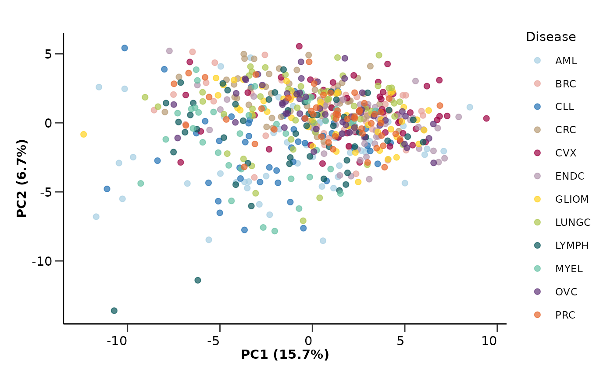

``` r

pca_res$pca_loadings_plot
```

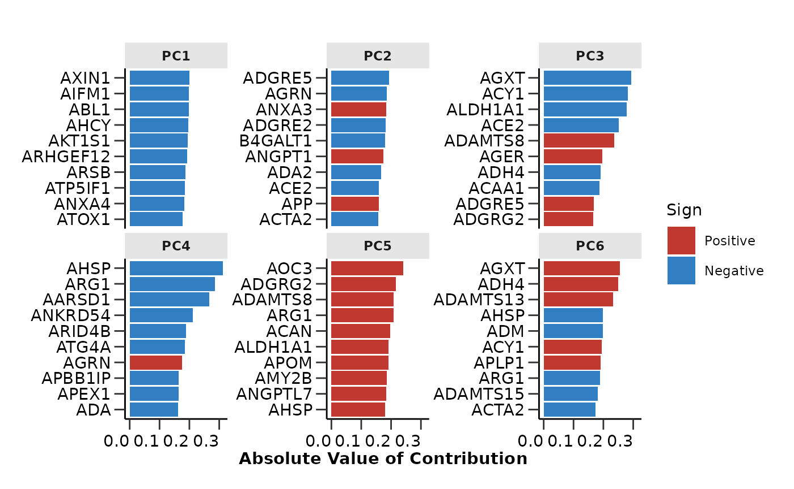

``` r

pca_res$pca_variance_plot
```

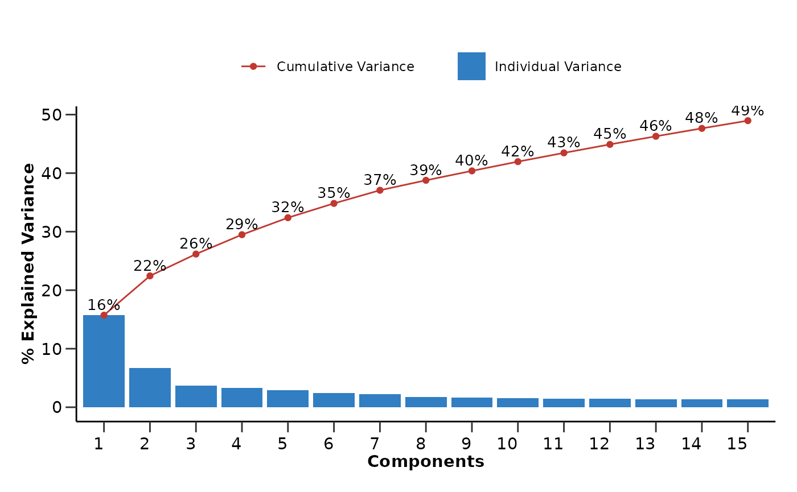

This time we want to color based on a continuous variable, the `Age`. In
this case, we can either bin the data into categories using
[`hd_bin_columns()`](https://kantonopoulos.github.io/HDAnalyzeR/reference/hd_bin_columns.md)
and use a categorical palette as before or use a continuous color
palette directly after the plot is created. We will do the second by
setting the palette argument to NULL and using the `viridis` palette
afterwards.

``` r

umap_res <- hd_umap(hd_obj, components = 2) |> 
  hd_plot_dim(hd_obj, "UMAP1", "UMAP2", color = "Age", palette = NULL)

umap_res$umap_plot + scale_color_viridis()
```

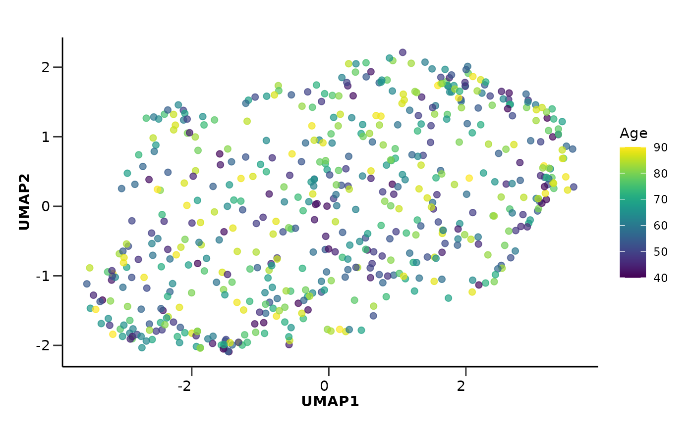

We can also run a UMAP where the data points are Proteins (or any
feature) instead of samples. The only thing we need to do is to set the
`by_sample` parameter to `FALSE` and pass the `Assay` column as the
`plot_color` parameter. We can also pass a custom palette to color the
different assays. This time we will use the wrapper function
[`hd_auto_umap()`](https://kantonopoulos.github.io/HDAnalyzeR/reference/hd_auto_umap.md).
The wrapper functions are a bit less flexible but they are easier to use
and require less code.

``` r

umap_res <- hd_auto_umap(hd_obj, 
                         by_sample = FALSE, 
                         plot_color = "Assay",
                         plot_palette = c("ADA" = "darkblue", 
                                          "ABL1" = "red3", 
                                          "ACAN" = "green3"))

head(umap_res$umap_res)
#> # A tibble: 6 × 3
#>   Assay   UMAP1  UMAP2
#>   <chr>   <dbl>  <dbl>
#> 1 AARSD1  3.50   2.25 
#> 2 ABL1    3.19   0.255
#> 3 ACAA1   1.90  -0.679
#> 4 ACAN   -0.488 -1.08 
#> 5 ACE2    0.330 -0.343
#> 6 ACOX1  -1.36  -1.87
umap_res$umap_plot
```

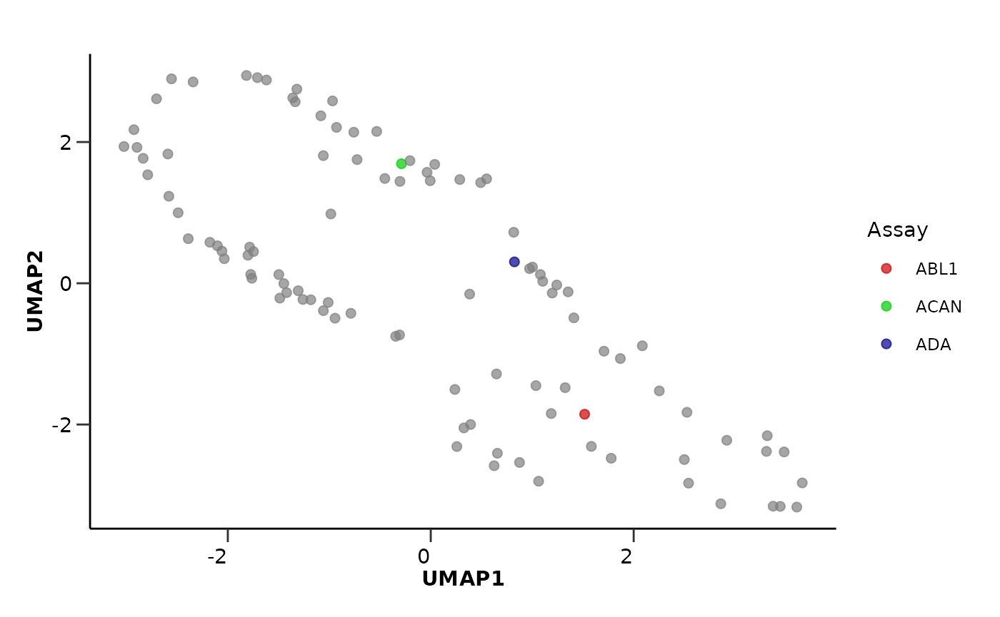

> 📓 Remember that these data are a dummy-dataset with artificial data
> and the results in this guide should not be interpreted as real
> results. The purpose of this vignette is to show you how to use the
> package and its functions.

``` r

sessionInfo()
#> R version 4.6.1 (2026-06-24)
#> Platform: x86_64-pc-linux-gnu
#> Running under: Ubuntu 24.04.4 LTS
#> 
#> Matrix products: default
#> BLAS:   /usr/lib/x86_64-linux-gnu/openblas-pthread/libblas.so.3 
#> LAPACK: /usr/lib/x86_64-linux-gnu/openblas-pthread/libopenblasp-r0.3.26.so;  LAPACK version 3.12.0
#> 
#> locale:
#>  [1] LC_CTYPE=C.UTF-8       LC_NUMERIC=C           LC_TIME=C.UTF-8       
#>  [4] LC_COLLATE=C.UTF-8     LC_MONETARY=C.UTF-8    LC_MESSAGES=C.UTF-8   
#>  [7] LC_PAPER=C.UTF-8       LC_NAME=C              LC_ADDRESS=C          
#> [10] LC_TELEPHONE=C         LC_MEASUREMENT=C.UTF-8 LC_IDENTIFICATION=C   
#> 
#> time zone: UTC
#> tzcode source: system (glibc)
#> 
#> attached base packages:
#> [1] stats     graphics  grDevices utils     datasets  methods   base     
#> 
#> other attached packages:
#> [1] viridis_0.6.5     viridisLite_0.4.3 patchwork_1.3.2   ggplot2_4.0.3    
#> [5] dplyr_1.2.1       glmnet_5.0        Matrix_1.7-5      HDAnalyzeR_1.1.0 
#> 
#> loaded via a namespace (and not attached):
#>   [1] matrixStats_1.5.0       fs_2.1.0                enrichplot_1.32.0      
#>   [4] fontawesome_0.5.3       lubridate_1.9.5         sparsevctrs_0.3.6      
#>   [7] DiceDesign_1.10         httr_1.4.8              RColorBrewer_1.1-3     
#>  [10] doParallel_1.0.17       prabclus_2.3-5          dynamicTreeCut_1.63-1  
#>  [13] backports_1.5.1         tools_4.6.1             doRNG_1.8.6.3          
#>  [16] utf8_1.2.6              R6_2.6.1                mgcv_1.9-4             
#>  [19] lazyeval_0.2.3          uwot_0.2.4              yardstick_1.4.0        
#>  [22] withr_3.0.3             gridExtra_2.3.1         downlit_0.4.5          
#>  [25] preprocessCore_1.74.0   WGCNA_1.74              cli_3.6.6              
#>  [28] Biobase_2.72.0          textshaping_1.0.5       scatterpie_0.2.6       
#>  [31] labeling_0.4.3          sass_0.4.10             diptest_0.77-2         
#>  [34] S7_0.2.2                robustbase_0.99-7       randomForest_4.7-1.2   
#>  [37] ggridges_0.5.7          tune_2.1.0              askpass_1.2.1          
#>  [40] pkgdown_2.2.1           systemfonts_1.3.2       yulab.utils_0.2.4      
#>  [43] foreign_0.8-91          gson_0.2.1              DOSE_4.6.0             
#>  [46] parallelly_1.48.0       itertools_0.1-3         limma_3.68.5           
#>  [49] impute_1.86.0           rstudioapi_0.19.0       RSQLite_3.53.3         
#>  [52] shape_1.4.6.1           generics_0.1.4          gridGraphics_0.5-1     
#>  [55] GO.db_3.23.1            ggbeeswarm_0.7.3        fansi_1.0.7            
#>  [58] S4Vectors_0.50.1        lifecycle_1.0.5         whisker_0.4.1          
#>  [61] yaml_2.3.12             recipes_1.3.3           qvalue_2.44.0          
#>  [64] grid_4.6.1              blob_1.3.0              crayon_1.5.3           
#>  [67] ggtangle_0.1.2          lattice_0.22-9          KEGGREST_1.52.2        
#>  [70] pillar_1.11.1           knitr_1.51              fpc_2.2-14             
#>  [73] future.apply_1.20.2     codetools_0.2-20        glue_1.8.1             
#>  [76] ggiraph_0.9.6           rsample_1.3.2           ggfun_0.2.1            
#>  [79] fontLiberation_0.1.0    data.table_1.18.4       vctrs_0.7.3            
#>  [82] png_0.1-9               treeio_1.36.1           Rdpack_2.6.6           
#>  [85] gtable_0.3.6            kernlab_0.9-33          cachem_1.1.0           
#>  [88] gower_1.0.2             xfun_0.60               rbibutils_2.4.1        
#>  [91] prodlim_2026.03.11      tidygraph_1.3.1         Seqinfo_1.2.0          
#>  [94] survival_3.8-6          timeDate_4052.112       aisdk_1.4.12           
#>  [97] pheatmap_1.0.13         iterators_1.0.14        hardhat_1.4.3          
#> [100] lava_1.9.2              statmod_1.5.2           ipred_0.9-15           
#> [103] nlme_3.1-169            ggtree_4.2.0            bit64_4.8.2            
#> [106] fontquiver_0.2.1        RcppAnnoy_0.0.23        UpSetR_1.4.1           
#> [109] bslib_0.12.0            vipor_0.4.7             otel_0.2.0             
#> [112] rpart_4.1.27            colorspace_2.1-3        Hmisc_5.2-6            
#> [115] BiocGenerics_0.58.1     DBI_1.3.0               nnet_7.3-20            
#> [118] ppsr_0.0.5              tidyselect_1.2.1        processx_3.9.0         
#> [121] bit_4.6.0               compiler_4.6.1          curl_7.1.0             
#> [124] httr2_1.3.0             htmlTable_2.5.0         xml2_1.6.0             
#> [127] desc_1.4.3              fontBitstreamVera_0.1.1 checkmate_2.3.4        
#> [130] scales_1.4.0            DEoptimR_1.2-0          callr_3.8.0            
#> [133] rappdirs_0.3.4          stringr_1.6.0           digest_0.6.39          
#> [136] rmarkdown_2.31          XVector_0.52.0          base64enc_0.1-6        
#> [139] htmltools_0.5.9         pkgconfig_2.0.3         fastmap_1.2.0          
#> [142] rlang_1.3.0             htmlwidgets_1.6.4       farver_2.1.2           
#> [145] jquerylib_0.1.4         jsonlite_2.0.0          mclust_6.1.3           
#> [148] GOSemSim_2.38.3         magrittr_2.0.5          Formula_1.2-6          
#> [151] modeltools_0.2-24       ggplotify_0.1.3         tailor_0.1.0           
#> [154] Rcpp_1.1.2              ape_5.8-1               ggnewscale_0.5.2       
#> [157] gdtools_0.5.1           furrr_0.4.0             stringi_1.8.9          
#> [160] ggraph_2.2.2            MASS_7.3-65             plyr_1.8.9             
#> [163] org.Hs.eg.db_3.23.1     embed_1.2.2             flexmix_2.3-20         
#> [166] tidyheatmaps_0.2.1      parallel_4.6.1          listenv_1.0.0          
#> [169] ggrepel_0.9.8           graphlayouts_1.2.5      Biostrings_2.80.1      
#> [172] splines_4.6.1           ps_1.9.3                fastcluster_1.3.0      
#> [175] igraph_2.3.3            ranger_0.18.0           enrichit_0.2.1         
#> [178] dials_1.4.4             rngtools_1.5.2          reshape2_1.4.5         
#> [181] parsnip_1.6.0           stats4_4.6.1            evaluate_1.0.5         
#> [184] foreach_1.5.2           missForest_1.6.1        tweenr_2.0.3           
#> [187] tidyr_1.3.2             openssl_2.4.2           purrr_1.2.2            
#> [190] polyclip_1.10-7         future_1.75.0           ggforce_0.5.0          
#> [193] easyPubMed_3.1.6        RSpectra_0.16-2         tidytree_0.4.8         
#> [196] tidydr_0.0.6            class_7.3-23            ragg_1.5.2             
#> [199] tibble_3.3.1            clusterProfiler_4.20.0  aplot_0.3.1            
#> [202] beeswarm_0.4.0          memoise_2.0.1           AnnotationDbi_1.74.0   
#> [205] IRanges_2.46.0          cluster_2.1.8.2         workflows_1.3.0        
#> [208] timechange_0.4.0        globals_0.19.1
```
