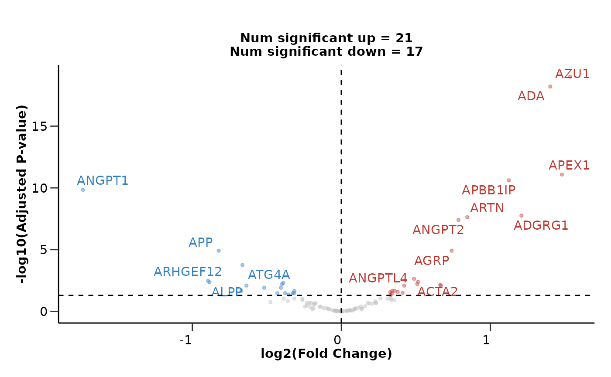
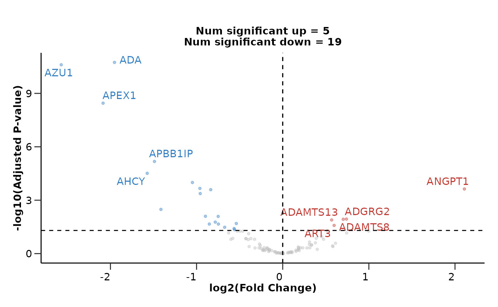
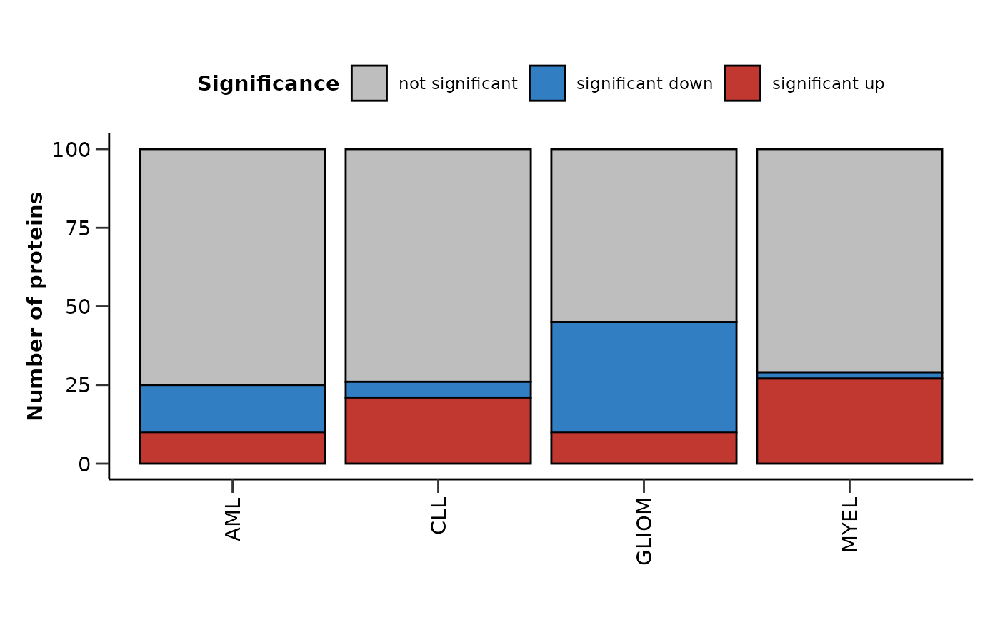
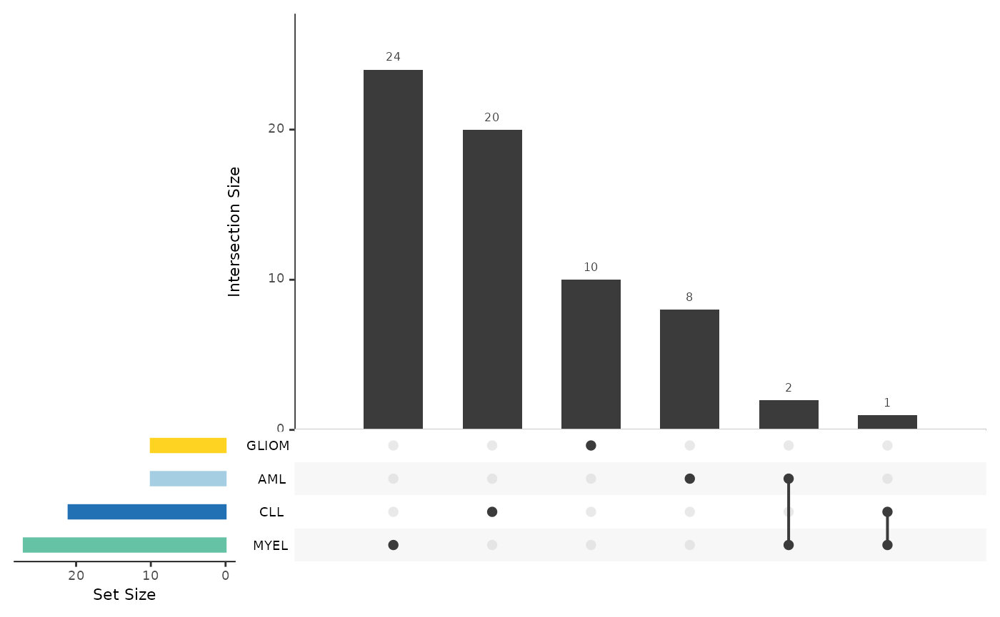
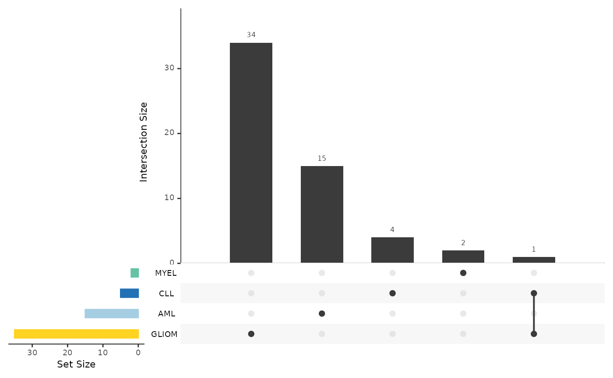

# Differential Expression Analysis

This vignette will guide you through the differential expression
analysis of your data. We will load HDAnalyzeR, load the example data
and metadata that come with the package and initialize the HDAnalyzeR
object.

## Loading the Data

``` r
library(HDAnalyzeR)

hd_obj <- hd_initialize(dat = example_data, 
                        metadata = example_metadata, 
                        is_wide = FALSE, 
                        sample_id = "DAid",
                        var_name = "Assay",
                        value_name = "NPX")
```

## Running Differential Expression Analysis with limma

We will start by running a simple differential expression analysis using
the
[`hd_de_limma()`](https://kantonopoulos.github.io/HDAnalyzeR/reference/hd_de_limma.md)
function. In this function we have to state the variable of interest,
the group of this variable that will be the case, as well as the
control(s). We will also correct for both `Sex` and `Age` variables.
After the analysis is done, we will use
[`hd_plot_volcano()`](https://kantonopoulos.github.io/HDAnalyzeR/reference/hd_plot_volcano.md)
to visualize the results.

In the first example, we will run a differential expression analysis for
the `AML` case against the `CLL` control.

``` r
de_results <- hd_de_limma(hd_obj, 
                          variable = "Disease", 
                          case = "AML", 
                          control = "CLL", 
                          correct = c("Age", "Sex")) |> 
  hd_plot_volcano()

head(de_results$de_res)
#> # A tibble: 6 × 10
#>   Feature logFC   CI.L   CI.R AveExpr     t      P.Value adj.P.Val     B Disease
#>   <chr>   <dbl>  <dbl>  <dbl>   <dbl> <dbl>        <dbl>     <dbl> <dbl> <chr>  
#> 1 ADA      1.42  0.955  1.89    1.56   6.04 0.0000000250   2.50e-6  8.74 AML    
#> 2 ADAM8   -1.23 -1.67  -0.795   1.74  -5.59 0.000000193    9.64e-6  6.77 AML    
#> 3 AZU1     1.92  1.20   2.64    0.777  5.30 0.000000668    2.23e-5  5.57 AML    
#> 4 ARID4B  -1.38 -1.91  -0.847   1.85  -5.15 0.00000132     3.30e-5  4.92 AML    
#> 5 ARTN     1.08  0.597  1.55    0.804  4.46 0.0000227      3.84e-4  2.22 AML    
#> 6 ANGPT1  -1.71 -2.47  -0.948   0.992 -4.45 0.0000230      3.84e-4  2.21 AML
de_results$volcano_plot
```


We are able to state more control groups if we want to. We can also
change the correction for the variables as well as both the p-value and
logFC significance thresholds.

``` r
de_results <- hd_de_limma(hd_obj, 
                              case = "AML", 
                              control = c("CLL", "MYEL", "GLIOM"), 
                              correct = "BMI") |> 
  hd_plot_volcano(pval_lim = 0.01, logfc_lim  = 1)

de_results$volcano_plot
```


If we do not set a control group, the function will compare the case
group against all other groups.

``` r
de_results <- hd_de_limma(hd_obj, case = "AML", correct = c("Age", "Sex")) |> 
  hd_plot_volcano()

de_results$volcano_plot
```



## Customizing the Volcano Plot

We can customize the volcano plot further by adding a title and not
displaying the number of significant proteins. We can also change the
number of significant proteins that will be displayed with their names
in the plot.

``` r
de_results <- hd_de_limma(hd_obj, case = "AML", correct = c("Age", "Sex")) |> 
  hd_plot_volcano(report_nproteins = FALSE, 
                  title = "AML vs all other groups",
                  top_up_prot = 3,
                  top_down_prot = 1)

de_results$volcano_plot
```


## Running Differential Expression Analysis with t-test

Let’s move to another method. We will use the
[`hd_de_ttest()`](https://kantonopoulos.github.io/HDAnalyzeR/reference/hd_de_ttest.md)
that performs a t-test for each variable. This function takes similar
inputs with
[`hd_de_limma()`](https://kantonopoulos.github.io/HDAnalyzeR/reference/hd_de_limma.md)
but it cannot correct for other variables like `Sex` and `Age`.

``` r
de_results <- hd_de_ttest(hd_obj, case = "AML") |> 
  hd_plot_volcano()

de_results$volcano_plot
```


## The case of Sex-specific Diseases

If we have diseases that are sex specific like Breast Cancer for
example, we should consider run the analysis only with samples of that
sex. We can easily integrate that into our pipeline using the
[`hd_filter()`](https://kantonopoulos.github.io/HDAnalyzeR/reference/hd_filter.md)
function. In that case, we would not be able to correct for sex, as
there will be only one sex “F” (female).

``` r
de_results <- hd_obj |> 
  hd_filter(variable = "Sex", values = "F", flag = "k") |> 
  hd_de_limma(case = "BRC", control = "AML", correct = "Age") |> 
  hd_plot_volcano()
#> Variable Sex is categorical
#> Filtering complete. Rows remaining:366

de_results$volcano_plot
```



## Running DE against other Variables

### Other Categorical Variables

We could also run differential expression against another categorical
variable like `Sex` by changing the `variable` argument.

``` r
de_results <- hd_de_limma(hd_obj, variable = "Sex", case = "F", correct = "Age") |> 
  hd_plot_volcano(report_nproteins = FALSE, title = "Sex Comparison")

de_results$volcano_plot
```


### Continuous Variables

Moreover, we can also perform Differential Expression Analysis against a
continuous variable such as `Age`. This can be done only with
[`hd_de_limma()`](https://kantonopoulos.github.io/HDAnalyzeR/reference/hd_de_limma.md)!
We can also correct for categorical and other continuous variables. In
this case, no `case` or `control` groups are needed.

``` r
de_results <- hd_de_limma(hd_obj, variable = "Age", case = NULL, correct = c("Sex", "BMI")) |> 
  hd_plot_volcano(report_nproteins = FALSE, title = "DE against Age")

de_results$volcano_plot
```


## Summarizing the Results from Multiple Analysis

As a last step, we can summarize the results via
[`hd_plot_de_summary()`](https://kantonopoulos.github.io/HDAnalyzeR/reference/hd_plot_de_summary.md).
Let’s first run a differential expression analysis for 4 different cases
(1 vs 3).

``` r
res_aml <- hd_de_limma(hd_obj, case = "AML", control = c("CLL", "MYEL", "GLIOM"))

res_cll <- hd_de_limma(hd_obj, case = "CLL", control = c("AML", "MYEL", "GLIOM"))

res_myel <- hd_de_limma(hd_obj, case = "MYEL" , control = c("AML", "CLL", "GLIOM"))

res_gliom <- hd_de_limma(hd_obj, case = "GLIOM" , control = c("AML", "CLL", "MYEL"))

de_summary_res <- hd_plot_de_summary(list("AML" = res_aml, 
                                          "CLL" = res_cll, 
                                          "MYEL" = res_myel, 
                                          "GLIOM" = res_gliom),
                                     class_palette = "cancers12")
```

``` r
de_summary_res$de_barplot
```



``` r
de_summary_res$upset_plot_up
```



``` r
de_summary_res$upset_plot_down
```



> 📓 Remember that these data are a dummy-dataset with artificial data
> and the results in this guide should not be interpreted as real
> results. The purpose of this vignette is to show you how to use the
> package and its functions.

``` r
sessionInfo()
#> R version 4.5.2 (2025-10-31)
#> Platform: x86_64-pc-linux-gnu
#> Running under: Ubuntu 24.04.3 LTS
#> 
#> Matrix products: default
#> BLAS:   /usr/lib/x86_64-linux-gnu/openblas-pthread/libblas.so.3 
#> LAPACK: /usr/lib/x86_64-linux-gnu/openblas-pthread/libopenblasp-r0.3.26.so;  LAPACK version 3.12.0
#> 
#> locale:
#>  [1] LC_CTYPE=C.UTF-8       LC_NUMERIC=C           LC_TIME=C.UTF-8       
#>  [4] LC_COLLATE=C.UTF-8     LC_MONETARY=C.UTF-8    LC_MESSAGES=C.UTF-8   
#>  [7] LC_PAPER=C.UTF-8       LC_NAME=C              LC_ADDRESS=C          
#> [10] LC_TELEPHONE=C         LC_MEASUREMENT=C.UTF-8 LC_IDENTIFICATION=C   
#> 
#> time zone: UTC
#> tzcode source: system (glibc)
#> 
#> attached base packages:
#> [1] stats     graphics  grDevices utils     datasets  methods   base     
#> 
#> other attached packages:
#> [1] HDAnalyzeR_1.0.1
#> 
#> loaded via a namespace (and not attached):
#>  [1] gtable_0.3.6       limma_3.66.0       jsonlite_2.0.0     dplyr_1.2.0       
#>  [5] compiler_4.5.2     Rcpp_1.1.1         tidyselect_1.2.1   stringr_1.6.0     
#>  [9] gridExtra_2.3      tidyr_1.3.2        jquerylib_0.1.4    scales_1.4.0      
#> [13] systemfonts_1.3.1  textshaping_1.0.4  yaml_2.3.12        fastmap_1.2.0     
#> [17] statmod_1.5.1      plyr_1.8.9         UpSetR_1.4.0       ggplot2_4.0.2     
#> [21] R6_2.6.1           labeling_0.4.3     generics_0.1.4     knitr_1.51        
#> [25] htmlwidgets_1.6.4  MASS_7.3-65        ggrepel_0.9.6      tibble_3.3.1      
#> [29] desc_1.4.3         RColorBrewer_1.1-3 bslib_0.10.0       pillar_1.11.1     
#> [33] rlang_1.1.7        utf8_1.2.6         stringi_1.8.7      cachem_1.1.0      
#> [37] xfun_0.56          S7_0.2.1           fs_1.6.6           sass_0.4.10       
#> [41] cli_3.6.5          pkgdown_2.2.0      withr_3.0.2        magrittr_2.0.4    
#> [45] digest_0.6.39      grid_4.5.2         lifecycle_1.0.5    vctrs_0.7.1       
#> [49] evaluate_1.0.5     glue_1.8.0         farver_2.1.2       ragg_1.5.0        
#> [53] rmarkdown_2.30     purrr_1.2.1        tools_4.5.2        pkgconfig_2.0.3   
#> [57] htmltools_0.5.9
```
