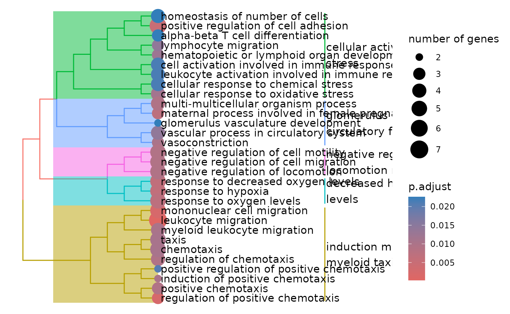
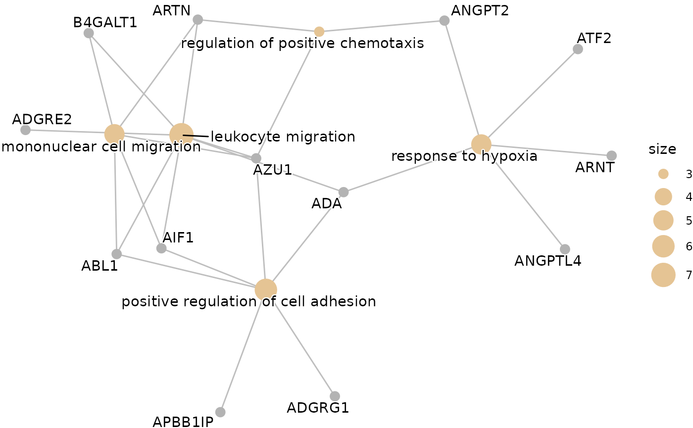
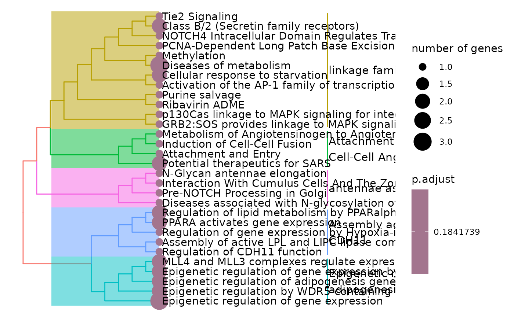
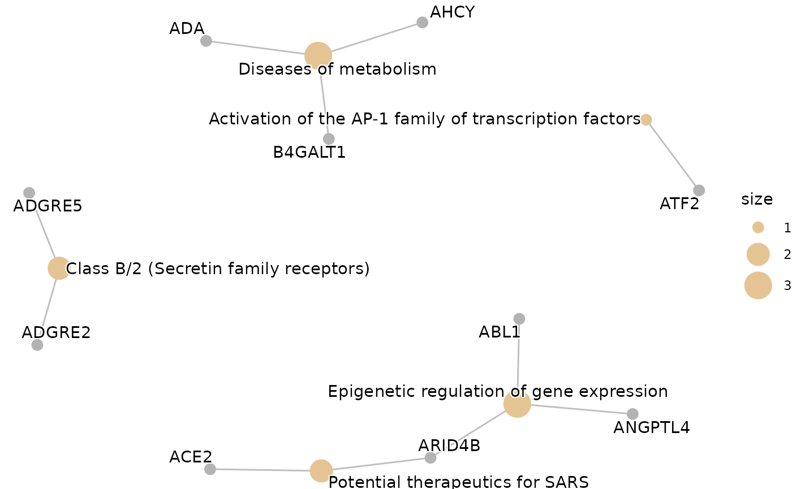
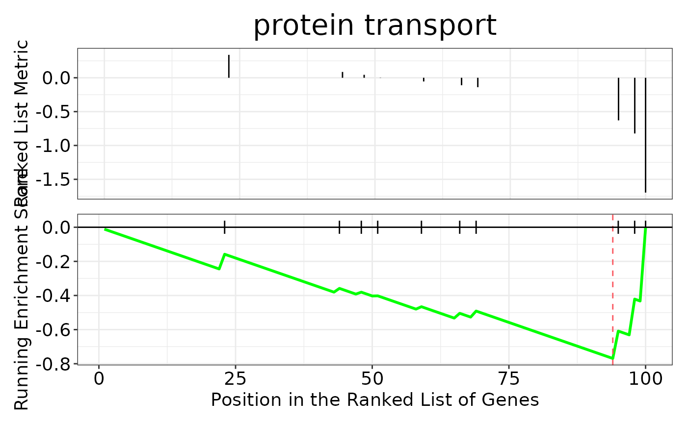
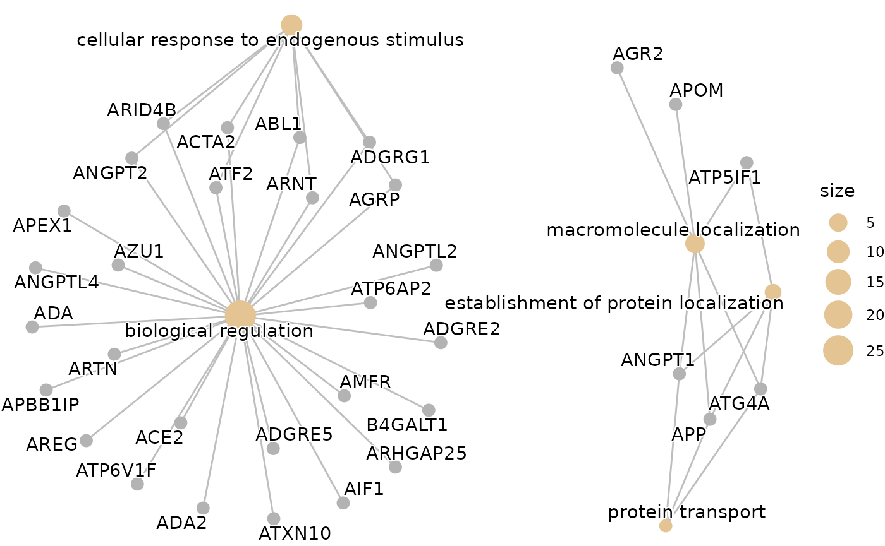

# Post Analysis: Pathway Enrichment

This vignette will guide you through the post analysis of the results
obtained from the HDAnalyzeR pipeline. The pathway enrichment analysis
is performed using the Gene Ontology, KEGG and Reactome databases from
`clusterProfiler` and `ReactomePA` packages respectively.

If you want to learn more about ORA and GSEA, please refer to the
following publications:

- Chicco D, Agapito G. Nine quick tips for pathway enrichment analysis.
  PLoS Comput Biol. 2022 Aug 11;18(8):e1010348. doi:
  10.1371/journal.pcbi.1010348. PMID: 35951505; PMCID: PMC9371296.
  <https://pmc.ncbi.nlm.nih.gov/articles/PMC9371296/>
- <https://yulab-smu.top/biomedical-knowledge-mining-book/enrichment-overview.html#gsea-algorithm>

> 📓 Remember that these data are a dummy-dataset with artificial data
> and the results in this guide should not be interpreted as real
> results. This is why we are using extremely large p-value cutoffs in
> this case that should not be used in real data.

## Loading the Data

We will load HDAnalyzeR and dplyr, load the example data and metadata
that come with the package and initialize the HDAnalyzeR object.

``` r
library(HDAnalyzeR)
library(dplyr)

hd_obj <- hd_initialize(dat = example_data, 
                        metadata = example_metadata, 
                        is_wide = FALSE, 
                        sample_id = "DAid",
                        var_name = "Assay",
                        value_name = "NPX")
```

For the Over Representation Analysis we are going to use a list of
differentially expressed proteins. In this example we are going to use
the up-regulated proteins. We could also use the features list from the
classification models or even run both and get the intersect as it is
done in the Get Started guide.

``` r
de_res <- hd_de_limma(hd_obj, case = "AML")
```

## Over Representation Analysis

First, we will perform an Over Representation Analysis (ORA) using the
Gene Ontology database and the BP ontology. We will use the
[`hd_ora()`](https://kantonopoulos.github.io/HDAnalyzeR/reference/hd_ora.md)
and
[`hd_plot_ora()`](https://kantonopoulos.github.io/HDAnalyzeR/reference/hd_plot_ora.md)
functions to run the analysis and plot the results respectively.

``` r
proteins <- de_res$de_res |> 
  filter(logFC > 0 & adj.P.Val < 0.05) |> 
  pull(Feature)

enrichment <- hd_ora(proteins, database = "GO", ontology = "BP")

enrichment_plots <- hd_plot_ora(enrichment)

enrichment_plots$dotplot
```


``` r
enrichment_plots$treeplot
```



``` r
enrichment_plots$cnetplot
```



Let’s change the database and the p-value threshold.

``` r
enrichment  <- hd_ora(proteins, database = "Reactome", pval_lim = 0.2)

enrichment_plots <- hd_plot_ora(enrichment)

enrichment_plots$dotplot
```


``` r
enrichment_plots$treeplot
```



``` r
enrichment_plots$cnetplot
```



## Gene Set Enrichment Analysis

We can also run a Gene Set Enrichment Analysis (GSEA) using the
[`hd_gsea()`](https://kantonopoulos.github.io/HDAnalyzeR/reference/hd_gsea.md)
and `hd_plot_gsea` functions. The
[`hd_plot_gsea()`](https://kantonopoulos.github.io/HDAnalyzeR/reference/hd_plot_gsea.md)
function will plot the results.

> ⚠️ In this case, the function requires strictly differential
> expression results, so a ranked list of proteins is derived based on
> the `ranked_by` argument.

``` r
enrichment <- hd_gsea(de_res, database = "GO", ontology = "BP", pval_lim = 0.55)

enrichment_plots <- hd_plot_gsea(enrichment)

enrichment_plots$dotplot
```


``` r
enrichment_plots$gseaplot
```



``` r
enrichment_plots$cnetplot
```



``` r
enrichment_plots$ridgeplot
```


We can also change the ranking variable to the product of logFC and
-log(adjusted p value) instead of the default logFC by changing the
`ranked_by` argument to “both”. We could also use other variables such
as p-value or any other variable in the DE results. However, you should
use as ranking a variable that has some form of biological relevance of
the variable.

``` r
enrichment <- hd_gsea(de_res, 
                      database = "GO", 
                      ontology = "BP", 
                      pval_lim = 0.9, 
                      ranked_by = "both")

enrichment_plots <- hd_plot_gsea(enrichment)
enrichment_plots$cnetplot
```


> 📓 Remember once again that these data are a dummy-dataset with
> artificial data and the results in this guide should not be
> interpreted as real results. The purpose of this vignette is to show
> you how to use the package and its functions.

``` r
sessionInfo()
#> R version 4.5.2 (2025-10-31)
#> Platform: x86_64-pc-linux-gnu
#> Running under: Ubuntu 24.04.3 LTS
#> 
#> Matrix products: default
#> BLAS:   /usr/lib/x86_64-linux-gnu/openblas-pthread/libblas.so.3 
#> LAPACK: /usr/lib/x86_64-linux-gnu/openblas-pthread/libopenblasp-r0.3.26.so;  LAPACK version 3.12.0
#> 
#> locale:
#>  [1] LC_CTYPE=C.UTF-8       LC_NUMERIC=C           LC_TIME=C.UTF-8       
#>  [4] LC_COLLATE=C.UTF-8     LC_MONETARY=C.UTF-8    LC_MESSAGES=C.UTF-8   
#>  [7] LC_PAPER=C.UTF-8       LC_NAME=C              LC_ADDRESS=C          
#> [10] LC_TELEPHONE=C         LC_MEASUREMENT=C.UTF-8 LC_IDENTIFICATION=C   
#> 
#> time zone: UTC
#> tzcode source: system (glibc)
#> 
#> attached base packages:
#> [1] stats4    stats     graphics  grDevices utils     datasets  methods  
#> [8] base     
#> 
#> other attached packages:
#> [1] org.Hs.eg.db_3.22.0  AnnotationDbi_1.72.0 IRanges_2.44.0      
#> [4] S4Vectors_0.48.0     Biobase_2.70.0       BiocGenerics_0.56.0 
#> [7] generics_0.1.4       dplyr_1.2.0          HDAnalyzeR_1.0.1    
#> 
#> loaded via a namespace (and not attached):
#>   [1] RColorBrewer_1.1-3      jsonlite_2.0.0          tidydr_0.0.6           
#>   [4] magrittr_2.0.4          ggtangle_0.1.1          farver_2.1.2           
#>   [7] rmarkdown_2.30          fs_1.6.6                ragg_1.5.0             
#>  [10] vctrs_0.7.1             memoise_2.0.1           ggtree_4.0.4           
#>  [13] htmltools_0.5.9         gridGraphics_0.5-1      sass_0.4.10            
#>  [16] bslib_0.10.0            htmlwidgets_1.6.4       desc_1.4.3             
#>  [19] plyr_1.8.9              cachem_1.1.0            igraph_2.2.2           
#>  [22] lifecycle_1.0.5         pkgconfig_2.0.3         Matrix_1.7-4           
#>  [25] R6_2.6.1                fastmap_1.2.0           gson_0.1.0             
#>  [28] digest_0.6.39           aplot_0.2.9             enrichplot_1.30.4      
#>  [31] ggnewscale_0.5.2        patchwork_1.3.2         textshaping_1.0.4      
#>  [34] RSQLite_2.4.6           labeling_0.4.3          httr_1.4.8             
#>  [37] polyclip_1.10-7         compiler_4.5.2          bit64_4.6.0-1          
#>  [40] fontquiver_0.2.1        withr_3.0.2             S7_0.2.1               
#>  [43] graphite_1.56.0         BiocParallel_1.44.0     viridis_0.6.5          
#>  [46] DBI_1.2.3               ggforce_0.5.0           R.utils_2.13.0         
#>  [49] MASS_7.3-65             rappdirs_0.3.4          tools_4.5.2            
#>  [52] ape_5.8-1               scatterpie_0.2.6        R.oo_1.27.1            
#>  [55] glue_1.8.0              nlme_3.1-168            GOSemSim_2.36.0        
#>  [58] grid_4.5.2              cluster_2.1.8.1         reshape2_1.4.5         
#>  [61] fgsea_1.36.2            gtable_0.3.6            R.methodsS3_1.8.2      
#>  [64] tidyr_1.3.2             data.table_1.18.2.1     tidygraph_1.3.1        
#>  [67] XVector_0.50.0          ggrepel_0.9.6           pillar_1.11.1          
#>  [70] stringr_1.6.0           yulab.utils_0.2.4       limma_3.66.0           
#>  [73] splines_4.5.2           tweenr_2.0.3            treeio_1.34.0          
#>  [76] lattice_0.22-7          bit_4.6.0               tidyselect_1.2.1       
#>  [79] fontLiberation_0.1.0    GO.db_3.22.0            Biostrings_2.78.0      
#>  [82] knitr_1.51              reactome.db_1.95.0      fontBitstreamVera_0.1.1
#>  [85] gridExtra_2.3           Seqinfo_1.0.0           xfun_0.56              
#>  [88] graphlayouts_1.2.3      statmod_1.5.1           stringi_1.8.7          
#>  [91] lazyeval_0.2.2          ggfun_0.2.0             yaml_2.3.12            
#>  [94] ReactomePA_1.54.0       evaluate_1.0.5          codetools_0.2-20       
#>  [97] ggraph_2.2.2            gdtools_0.5.0           tibble_3.3.1           
#> [100] qvalue_2.42.0           graph_1.88.1            ggplotify_0.1.3        
#> [103] cli_3.6.5               systemfonts_1.3.1       jquerylib_0.1.4        
#> [106] Rcpp_1.1.1              png_0.1-8               parallel_4.5.2         
#> [109] pkgdown_2.2.0           ggplot2_4.0.2           blob_1.3.0             
#> [112] clusterProfiler_4.18.4  DOSE_4.4.0              viridisLite_0.4.3      
#> [115] tidytree_0.4.7          ggiraph_0.9.6           ggridges_0.5.7         
#> [118] scales_1.4.0            purrr_1.2.1             crayon_1.5.3           
#> [121] rlang_1.1.7             cowplot_1.2.0           fastmatch_1.1-8        
#> [124] KEGGREST_1.50.0
```
